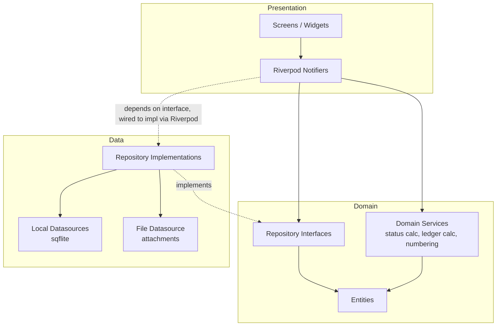
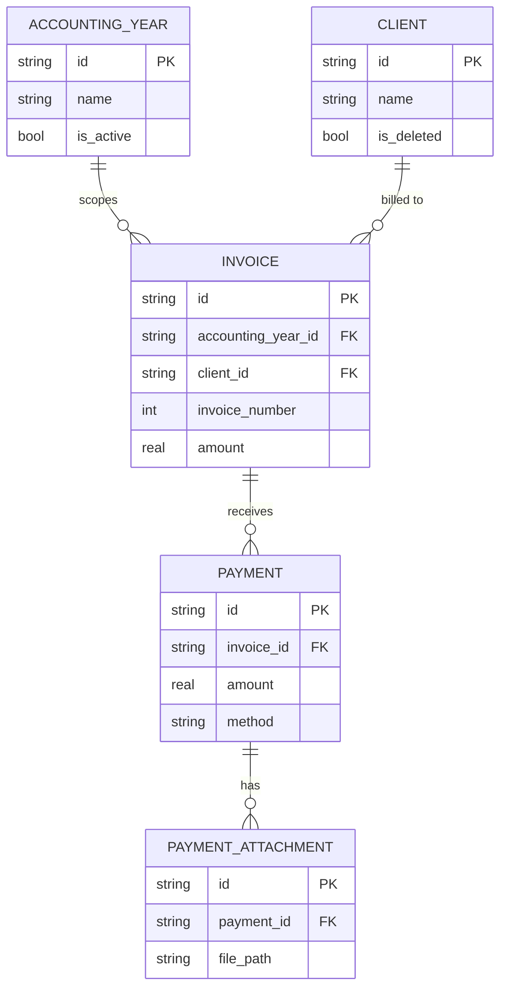
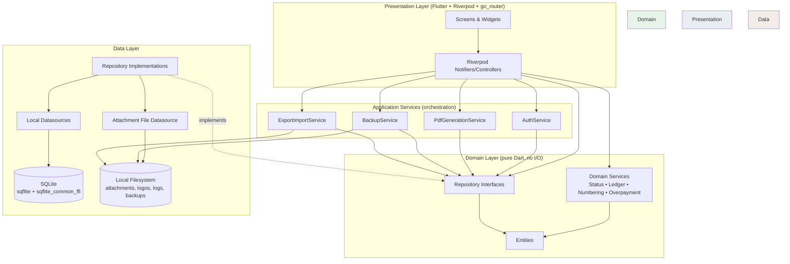

# PayMe — Software Architecture Document
### Offline-First Client Receivables Manager (Flutter · Windows Desktop · Android)

**Version:** 1.0
**Author role:** Principal Software Architect (design output)
**Audience:** Solo developer, building and maintaining the app long-term

---

## 1. Executive Summary

PayMe is a small, offline-first Flutter application that helps accountants and small businesses track client invoices, payments, and outstanding balances — without becoming accounting software itself. Version 1 targets Windows Desktop and Android, runs entirely on local SQLite with no backend, and is scoped tightly: one admin user, one currency, one accounting year active at a time, simple (non-itemized) invoices, strict one-invoice-to-many-payments allocation.

The architecture uses **Clean Architecture with a pragmatic, flattened middle layer**: entities and repository interfaces in a Domain layer, a small set of pure Domain Services for the few pieces of real business logic (balance calculation, status derivation, invoice numbering, overpayment detection), and direct Repository calls from the Presentation layer for everything else. This deliberately **rejects** a formal Use-Case-per-operation pattern — for a CRUD-heavy app of this size, one use case class per button press would be pure ceremony with no testability or maintainability benefit. The few places where real business rules live get isolated, pure, unit-testable classes; everything else stays simple.

**State management and DI: Riverpod** (no code generation required to start). It gives compile-time-safe dependency injection without a service locator, testable business logic without `BuildContext`, and works identically across desktop and mobile — for a solo developer, one framework doing both jobs beats wiring up `get_it` + a separate state management library.

**Persistence:** `sqflite` + `sqflite_common_ffi` (for Windows) behind a single `DatabaseProvider` abstraction, with a hand-written, versioned SQL migration system — chosen over an ORM like Drift specifically to avoid the build_runner/codegen overhead that isn't justified at ~7 tables.

The schema includes a small number of **nullable, unused-in-V1 columns** (`remote_id`, `synced_at`, `is_dirty`) on syncable tables. This costs nothing today (no logic touches them) and removes the single biggest future migration headache: adding sync columns retroactively to a database already full of user data in the field.

Every other future-facing concern — Laravel API migration, Google Drive backup, multi-user support — is handled the same way: **the Repository interface is the seam**. V1 implements repositories against SQLite; V2 can implement the *same interfaces* against a REST client, and nothing above the repository boundary (state management, UI, PDF generation, business rules) needs to change.

---

## 2. Architectural Decisions and Rationale

| Decision | Chosen | Rejected | Why |
|---|---|---|---|
| Overall structure | Clean Architecture, 3 layers, feature-first folders | Full onion architecture with use-case-per-action, MVC, ad-hoc "screen calls SQL directly" | Full Clean Architecture ceremony is disproportionate for ~7 entities and one developer. A flat "screen talks straight to SQLite" approach would be fast now but untestable and would hard-block the Laravel migration. The middle ground isolates business rules and the data source behind interfaces without inventing a use-case class for every trivial CRUD action. |
| State management | Riverpod | Bloc, Provider, GetX | Bloc's ceremony (events, states, mappers) doesn't pay for itself in an app this size. Provider is Riverpod's predecessor with weaker compile-time safety and harder testing. GetX's implicit service locator and magic reactivity make it fast to write and hard to maintain solo over years — the opposite of what's needed here. |
| Dependency Injection | Riverpod providers as composition root | `get_it` + `injectable`, manual singleton classes | Riverpod already provides typed, override-able DI. Adding a second DI framework alongside it would be two competing systems solving one problem. |
| Local database | `sqflite` + `sqflite_common_ffi`, raw SQL, hand-written migrations | Drift (formerly Moor), Floor, Isar | Drift/Floor add build_runner and a DSL to learn; their main payoff (compile-time query safety) matters more at 20+ tables. At ~7 tables, raw SQL behind typed Repository methods is simpler to read, debug, and modify at 2am. Isar is a NoSQL document store — a poor fit for genuinely relational data (clients→invoices→payments). |
| Business logic location | Small set of pure Domain Services (calculations only) | Use-case class per operation; business logic in widgets; business logic in repository implementations | Isolating money-math (status, balance, overpayment) in pure, dependency-free classes makes the one part of this app where bugs are expensive (financial correctness) trivially unit-testable, without forcing every "rename a client" action through a formal use case. |
| Navigation | `go_router` | Manual `Navigator 2.0`, `Navigator 1.0` push/pop only | Two platforms (desktop + mobile) both benefit from declarative, URL-shaped routing, especially for deep-linking into a specific invoice or client ledger later. Manual Navigator 2.0 is more flexible but is meaningfully more boilerplate for no benefit at this scope. |
| PDF generation | `pdf` + `printing` packages | Server-rendered PDF, HTML-to-PDF via webview | Both are pure Dart, work offline, run identically on Windows and Android, and are the de facto standard for Flutter-native PDF generation. |
| Backup format | Self-contained ZIP (DB + attachments + metadata.json) | Cloud-only backup, plain unzipped folder | A single ZIP is portable, user-understandable ("one file, back it up anywhere"), and is exactly the artifact a future "upload to Google Drive" feature would need — no format change required later, just a new destination. |
| Password storage | PBKDF2 (via `cryptography` package) + per-user salt, stored via `flutter_secure_storage` | `bcrypt` package, plain SHA-256 | `bcrypt`'s native bindings have had platform friction on Windows in Flutter; `cryptography` is pure-Dart/well-maintained and works identically cross-platform. Plain SHA-256 has no work-factor and is unsuitable for password storage even for a single local account. |
| Sync-readiness | 3 nullable columns (`remote_id`, `synced_at`, `is_dirty`) added now to core tables, unused in V1 | No columns now; add via migration in V2 | Retrofitting sync columns onto tables already containing years of live user data is strictly harder and riskier than shipping them empty from day one. Cost in V1 is zero — nothing reads or writes them. This is the one deliberate exception to "don't build for V2," justified because it removes risk rather than adding complexity. |

---

## 3. Recommended Folder Structure

Feature-first within each Clean Architecture layer — this keeps everything related to "Invoices" discoverable in one place rather than scattered across generic `models/`, `screens/`, `blocs/` folders.

```
lib/
├── main.dart
├── app.dart                          # MaterialApp/router root, theme
│
├── core/
│   ├── database/
│   │   ├── database_provider.dart    # sqflite/sqflite_common_ffi bootstrap
│   │   ├── migrations/               # v1_initial.sql, v2_xxx.sql, ...
│   │   └── migration_runner.dart
│   ├── error/
│   │   ├── failures.dart             # sealed Failure classes
│   │   └── result.dart               # Result<T> (Success/Failure)
│   ├── security/
│   │   ├── password_hasher.dart
│   │   └── secure_storage_service.dart
│   ├── storage/
│   │   └── app_paths.dart            # resolves platform storage dirs
│   ├── logging/
│   │   └── logger_service.dart
│   ├── theme/
│   ├── constants/
│   └── utils/
│
├── domain/
│   ├── entities/
│   │   ├── accounting_year.dart
│   │   ├── client.dart
│   │   ├── invoice.dart
│   │   ├── payment.dart
│   │   ├── payment_attachment.dart
│   │   ├── business_settings.dart
│   │   └── invoice_status.dart       # enum: unpaid/partial/paid/overpaid
│   ├── repositories/                 # abstract interfaces ONLY
│   │   ├── accounting_year_repository.dart
│   │   ├── client_repository.dart
│   │   ├── invoice_repository.dart
│   │   ├── payment_repository.dart
│   │   ├── settings_repository.dart
│   │   └── backup_repository.dart
│   └── services/                     # pure business logic, no I/O
│       ├── invoice_status_calculator.dart
│       ├── client_ledger_calculator.dart
│       ├── invoice_number_generator.dart
│       └── overpayment_detector.dart
│
├── data/
│   ├── datasources/
│   │   ├── local/
│   │   │   ├── client_local_datasource.dart
│   │   │   ├── invoice_local_datasource.dart
│   │   │   ├── payment_local_datasource.dart
│   │   │   ├── accounting_year_local_datasource.dart
│   │   │   └── settings_local_datasource.dart
│   │   └── file/
│   │       └── attachment_file_datasource.dart
│   ├── models/                       # DTOs: toMap/fromMap <-> entities
│   │   ├── client_model.dart
│   │   ├── invoice_model.dart
│   │   └── ...
│   └── repositories_impl/
│       ├── client_repository_impl.dart
│       ├── invoice_repository_impl.dart
│       ├── payment_repository_impl.dart
│       ├── accounting_year_repository_impl.dart
│       ├── settings_repository_impl.dart
│       └── backup_repository_impl.dart
│
├── services/                         # application-level orchestrating services
│   ├── auth_service.dart
│   ├── pdf_generation_service.dart
│   ├── backup_service.dart
│   └── export_import_service.dart
│
└── presentation/
    ├── routing/
    │   └── app_router.dart           # go_router config
    ├── providers/                    # cross-feature Riverpod providers
    │   └── repository_providers.dart
    └── features/
        ├── auth/
        ├── dashboard/
        ├── accounting_years/
        ├── clients/
        │   ├── controllers/          # Riverpod Notifiers
        │   ├── screens/
        │   └── widgets/
        ├── invoices/
        ├── payments/
        ├── reports/
        ├── settings/
        └── backup/
```

**Rationale:** `domain/` has zero dependencies on Flutter or SQLite — it's pure Dart and fully unit-testable in isolation. `data/` depends on `domain/` (implements its interfaces) and on `sqflite`. `presentation/` depends on both. Dependencies point inward, which is the one Clean Architecture rule actually worth enforcing here — it's what makes the Laravel migration (Section 19) a data-layer swap instead of a rewrite.

---

## 4. Clean Architecture Layers



- **Presentation** never imports `sqflite` or any `data/` class directly — only `domain/` interfaces and entities, plus Domain Services for calculations.
- **Domain** has no Flutter or SQLite imports at all. It is plain Dart and can be unit-tested with zero setup.
- **Data** is the only layer that knows SQLite exists. Swapping to a REST-backed implementation later touches only this layer.

This is intentionally **not** a 4-layer setup with a separate Use Case layer between Presentation and Domain. Notifiers call Repository methods and Domain Services directly. A Use Case layer earns its keep when there are complex multi-step orchestrations reused across several screens; here, the orchestration (e.g., "delete invoice → delete payments → delete attachment files") is a handful of lines and lives fine as a Repository method or a small orchestrating Service (Section 11), not a dedicated class per action.

---

## 5. State Management Recommendation

**Riverpod** (`flutter_riverpod`), using plain `Notifier`/`AsyncNotifier` classes — **without** `riverpod_generator` to start, to avoid adding build_runner to the toolchain for a solo dev; codegen can be adopted later purely as a convenience if the manual boilerplate becomes annoying.

**Why not Bloc:** Bloc's separation of Events and States is valuable when multiple developers need a strict contract for how state changes, or when you need to replay/log every state transition (e.g., for audit tooling). Neither applies to a single-developer offline app. The event-mapping ceremony would roughly double the code for the same behavior.

**Why not plain `Provider`:** `Provider` (the package) is Riverpod's predecessor and has since been effectively superseded by it — Riverpod fixes `Provider`'s reliance on `BuildContext` for reads and its weaker compile-time guarantees around provider scoping.

**Why not GetX:** GetX optimizes for typing speed via global service-locator-style access and implicit reactivity (`.obs` variables). This is fast to prototype but makes it hard to reason about what depends on what a year later, and its testing story is weaker than Riverpod's explicit `ProviderContainer` overrides.

**Pattern used throughout:**
```dart
final invoiceListProvider = AsyncNotifierProvider.family<
    InvoiceListController, List<Invoice>, String /* accountingYearId */>(
  InvoiceListController.new,
);

class InvoiceListController
    extends FamilyAsyncNotifier<List<Invoice>, String> {
  @override
  Future<List<Invoice>> build(String yearId) async {
    final repo = ref.watch(invoiceRepositoryProvider);
    return repo.getInvoicesForYear(yearId);
  }

  Future<void> addPayment(String invoiceId, Payment payment) async {
    final repo = ref.read(paymentRepositoryProvider);
    await repo.addPayment(invoiceId, payment);
    ref.invalidateSelf(); // refetch, recalculates status via repository
  }
}
```

---

## 6. Dependency Injection Strategy

Riverpod providers **are** the DI container — there is no separate service locator.

- **Leaf providers** expose singletons: `databaseProvider`, `secureStorageProvider`, `loggerProvider`.
- **Repository providers** depend on datasource providers and expose the *interface* type, not the implementation type, so Notifiers never know which implementation they're getting:
```dart
final invoiceRepositoryProvider = Provider<InvoiceRepository>((ref) {
  final db = ref.watch(databaseProvider);
  return InvoiceRepositoryImpl(db, ref.watch(invoiceStatusCalculatorProvider));
});
```
- **Testing** overrides providers directly:
```dart
final container = ProviderContainer(overrides: [
  invoiceRepositoryProvider.overrideWithValue(FakeInvoiceRepository()),
]);
```
This is the whole DI story. It requires no reflection, no code generation (unless later opted into), and no runtime registration step — the provider graph is just Dart objects, checkable by the compiler.

---

## 7. Domain Model Design

**Entities** (pure Dart classes, immutable, no persistence knowledge):

- `AccountingYear` — `id`, `name` (e.g. "2026"), `isActive`, `createdAt`.
- `Client` — `id` (UUID), `name`, `phone`, `email`, `address`, `notes`, `isDeleted`, `createdAt`.
- `Invoice` — `id`, `accountingYearId`, `clientId`, `invoiceNumber` (int, scoped to year), `date`, `description`, `amount`, `dueDate?`, `notes`.
- `Payment` — `id`, `invoiceId`, `date`, `amount`, `method` (enum: cash/cheque/bankTransfer), `reference`, `notes`.
- `PaymentAttachment` — `id`, `paymentId`, `filePath` (relative), `originalFileName`, `fileType` (pdf/jpg/png), `fileSizeBytes`.
- `BusinessSettings` — `businessName`, `address`, `phone`, `email`, `logoPath?`, `currencyCode`, `currencyLockedAt?`.
- `AdminCredential` — not a domain entity exposed to UI; lives entirely inside the security layer (Section 20).

**Derived, not stored:**
- `InvoiceStatus` (`unpaid` / `partiallyPaid` / `paid` / `overpaid`) is *always computed* from `amount` vs. `sum(payments)` by `InvoiceStatusCalculator` — never persisted as a column, so it can never drift out of sync with the payments that determine it.
- `Client` ledger totals (Total Invoiced / Total Paid / Remaining Balance) are computed per-accounting-year by `ClientLedgerCalculator`, not stored.

---

## 8. Entity Relationships



Key relationship rules enforced at the repository/DB layer:
- `Client` is global; only `Invoice` and everything below it is scoped to an `AccountingYear`.
- A `Client`'s "membership" in a year is implicit — derived from `EXISTS(SELECT 1 FROM invoices WHERE client_id = ? AND accounting_year_id = ?)`, not a stored enrollment row.
- Deleting an `Invoice` cascades to `Payment` and `PaymentAttachment` (rows + files).
- Deleting an `AccountingYear` cascades to its `Invoice`s → `Payment`s → `PaymentAttachment`s (rows + files), but never touches `Client`.

---

## 9. SQLite Database Schema

```sql
-- ============================================================
-- app_meta: single-row table tracking schema version
-- ============================================================
CREATE TABLE app_meta (
    id INTEGER PRIMARY KEY CHECK (id = 1),
    schema_version INTEGER NOT NULL
);

-- ============================================================
-- accounting_years
-- ============================================================
CREATE TABLE accounting_years (
    id TEXT PRIMARY KEY,
    name TEXT NOT NULL UNIQUE,          -- e.g. "2026"
    is_active INTEGER NOT NULL DEFAULT 0,
    created_at TEXT NOT NULL,
    -- sync-readiness (unused in V1, see Section 19)
    remote_id TEXT,
    synced_at TEXT,
    is_dirty INTEGER NOT NULL DEFAULT 0
);
-- Enforced in application code: only one row may have is_active = 1.

-- ============================================================
-- clients (GLOBAL — not scoped to a year)
-- ============================================================
CREATE TABLE clients (
    id TEXT PRIMARY KEY,                -- UUID, stable across export/import
    name TEXT NOT NULL,
    phone TEXT,
    email TEXT,
    address TEXT,
    notes TEXT,
    is_deleted INTEGER NOT NULL DEFAULT 0,
    created_at TEXT NOT NULL,
    updated_at TEXT NOT NULL,
    remote_id TEXT,
    synced_at TEXT,
    is_dirty INTEGER NOT NULL DEFAULT 0
);
CREATE INDEX idx_clients_is_deleted ON clients(is_deleted);

-- ============================================================
-- invoices
-- ============================================================
CREATE TABLE invoices (
    id TEXT PRIMARY KEY,
    accounting_year_id TEXT NOT NULL REFERENCES accounting_years(id),
    client_id TEXT NOT NULL REFERENCES clients(id),
    invoice_number INTEGER NOT NULL,
    date TEXT NOT NULL,
    description TEXT,
    amount REAL NOT NULL CHECK (amount >= 0),
    due_date TEXT,
    notes TEXT,
    created_at TEXT NOT NULL,
    updated_at TEXT NOT NULL,
    remote_id TEXT,
    synced_at TEXT,
    is_dirty INTEGER NOT NULL DEFAULT 0,
    UNIQUE (accounting_year_id, invoice_number)
);
CREATE INDEX idx_invoices_year ON invoices(accounting_year_id);
CREATE INDEX idx_invoices_client ON invoices(client_id);

-- ============================================================
-- payments
-- ============================================================
CREATE TABLE payments (
    id TEXT PRIMARY KEY,
    invoice_id TEXT NOT NULL REFERENCES invoices(id) ON DELETE CASCADE,
    date TEXT NOT NULL,
    amount REAL NOT NULL CHECK (amount > 0),
    method TEXT NOT NULL CHECK (method IN ('cash','cheque','bank_transfer')),
    reference TEXT,
    notes TEXT,
    created_at TEXT NOT NULL,
    updated_at TEXT NOT NULL,
    remote_id TEXT,
    synced_at TEXT,
    is_dirty INTEGER NOT NULL DEFAULT 0
);
CREATE INDEX idx_payments_invoice ON payments(invoice_id);

-- ============================================================
-- payment_attachments
-- ============================================================
CREATE TABLE payment_attachments (
    id TEXT PRIMARY KEY,
    payment_id TEXT NOT NULL REFERENCES payments(id) ON DELETE CASCADE,
    file_path TEXT NOT NULL,            -- relative to app attachments dir
    original_file_name TEXT NOT NULL,
    file_type TEXT NOT NULL CHECK (file_type IN ('pdf','jpg','png')),
    file_size_bytes INTEGER NOT NULL,
    created_at TEXT NOT NULL
);
CREATE INDEX idx_attachments_payment ON payment_attachments(payment_id);

-- ============================================================
-- business_settings (single row)
-- ============================================================
CREATE TABLE business_settings (
    id INTEGER PRIMARY KEY CHECK (id = 1),
    business_name TEXT,
    address TEXT,
    phone TEXT,
    email TEXT,
    logo_path TEXT,
    currency_code TEXT NOT NULL,
    currency_locked_at TEXT             -- set on first invoice creation
);

-- ============================================================
-- admin_credential (single row, security-sensitive)
-- ============================================================
CREATE TABLE admin_credential (
    id INTEGER PRIMARY KEY CHECK (id = 1),
    password_hash TEXT NOT NULL,
    password_salt TEXT NOT NULL,
    recovery_key_hash TEXT NOT NULL,
    recovery_key_salt TEXT NOT NULL,
    updated_at TEXT NOT NULL
);
```

**Notes:**
- All IDs are `TEXT` UUIDs, generated client-side (not autoincrement). This is essential for the export/import model in Section 15 (UUID-based client matching) and is also what makes the future Laravel migration painless (no ID remapping needed when syncing to a server).
- `ON DELETE CASCADE` handles Payment→Attachment and Invoice→Payment at the DB level; Year→Invoice cascade is handled explicitly in the repository (see Section 10) because it also needs to delete attachment *files*, which SQLite cannot do.
- Money is stored as `REAL`. For a single-currency, non-accounting app tracking simple totals (not performing complex multi-step arithmetic across many rows), this is an acceptable, pragmatic choice — see Section 22 for the trade-off discussion versus storing integer minor units.

---

## 10. Repository Design

Interfaces live in `domain/repositories/`; implementations in `data/repositories_impl/`.

```dart
abstract class InvoiceRepository {
  Future<List<Invoice>> getInvoicesForYear(String yearId);
  Future<List<Invoice>> getInvoicesForClient(String clientId, {String? yearId});
  Future<Invoice> getById(String id);
  Future<Invoice> create(Invoice invoice);
  Future<Invoice> update(Invoice invoice);
  Future<void> delete(String id); // cascades payments + attachment files
  Future<int> nextInvoiceNumber(String yearId);
}
```

```dart
abstract class AccountingYearRepository {
  Future<List<AccountingYear>> getAll();
  Future<AccountingYear> getActive();
  Future<AccountingYear> create(String name);
  Future<void> setActive(String yearId);
  Future<void> delete(String yearId); // blocked if yearId is active
  Future<void> rename(String yearId, String newName);
}
```

Similar interfaces exist for `ClientRepository` (including `softDelete`, `restore`, `getAllVisible`, `getAllIncludingDeleted`), `PaymentRepository`, `SettingsRepository`, and `BackupRepository`.

**Why the interface lives in Domain, not Data:** Presentation and Domain Services depend only on the interface. When Section 19's Laravel migration happens, a new `InvoiceRepositoryImpl` backed by `dio`/REST is written against the *same* interface, and nothing in `presentation/` or `domain/services/` changes at all.

**Orchestration that spans repositories** (e.g., deleting a year must delete invoices, payments, and attachment files, which touches three tables plus the filesystem) is handled by a small `AccountingYearRepositoryImpl.delete()` method that composes calls to the other repositories/datasources — not a separate Use Case class, since it's used from exactly one place (Section 3's rationale for skipping a formal Use Case layer).

---

## 11. Services Design

Distinct from Repositories (which are pure data access) and Domain Services (which are pure calculation), **Application Services** orchestrate multi-step, cross-cutting operations that involve I/O beyond a single repository:

| Service | Responsibility |
|---|---|
| `AuthService` | Verify password on launch, change password, run the recovery-key reset flow (Section 20). |
| `PdfGenerationService` | Compose an `Invoice` + `Client` + `BusinessSettings` into a PDF `Uint8List` via the `pdf` package; hand off to `printing` for preview/print/save. |
| `BackupService` | Full-database backup/restore: copy the SQLite file + attachments dir + settings into/out of a ZIP. |
| `ExportImportService` | Year-scoped export/import: builds a filtered dataset (one year's invoices/payments/attachments + the referenced client UUIDs) into a self-contained ZIP; on import, resolves client UUIDs per Section 15's rules. |

These sit in `services/` (not `data/`) because they depend on *multiple* repositories plus filesystem access — they are consumers of the Repository layer, not part of it.

---

## 12. Local File Storage Strategy

A single `AppPaths` abstraction (in `core/storage/`) resolves platform-correct directories once at startup, so nothing else in the app calls `path_provider` directly:

```
<app documents/support dir>/
├── payme.db
├── attachments/
│   └── <payment_id>/
│       └── <uuid>.<ext>
├── logos/
│   └── business_logo.<ext>
├── logs/
│   └── payme-2026-07.log
└── temp/                    # scratch space for in-progress exports/backups
```

- **Desktop (Windows):** `path_provider`'s application-support directory (`%APPDATA%/PayMe/`).
- **Android:** app-private external storage directory via `path_provider` (`getExternalFilesDir`) — this is *app-owned* storage, so Android's scoped-storage restrictions (which govern access to *other* apps' files or shared media) don't apply to it. Scoped storage only becomes relevant when the user explicitly **exports** a file to a location of their choosing (Section 15) — that path uses `file_picker`'s save-file API, which transparently uses the Storage Access Framework under the hood, requiring no manual SAF handling in application code.
- Attachments are stored **by UUID filename**, never by original filename, to avoid collisions and path-traversal concerns; `original_file_name` is retained in the DB purely for display.

---

## 13. Attachment Management

- A `Payment` may have multiple `PaymentAttachment` rows (many-to-one).
- On upload: file is copied into `attachments/<payment_id>/<uuid>.<ext>`, a row is inserted with the relative path, original name, type, and size.
- On payment delete: all attachment rows are deleted, and `AttachmentFileDatasource` deletes the corresponding files — wrapped so a failed file delete doesn't leave the DB row behind silently (logged as a warning; see Section 17).
- On invoice delete (cascading through payments): the same cleanup runs for every payment being removed.
- No enforced file-size limit is imposed by the app itself in V1 beyond a sane soft warning (e.g., >20MB) — SQLite doesn't store the binary (only the DB stores metadata; files live on disk), so this isn't a database bloat concern, only a device-storage one.

---

## 14. PDF Generation Architecture

```
PdfGenerationService
  ├── InvoicePdfTemplate (pure widget-tree-style composition using `pdf` package's widget API)
  │     ├── HeaderSection (logo + business info)
  │     ├── ClientSection (client info)
  │     ├── InvoiceDetailsSection (number, date, description, amount)
  │     └── FooterSection
  └── returns Uint8List
```

- One template for V1 — a single, clean, professional layout. The template is a pure function of `(Invoice, Client, BusinessSettings)` → bytes, with no I/O of its own, making it trivially testable (assert it doesn't throw / produces non-empty bytes for a range of inputs).
- The `printing` package is used purely at the presentation edge (`Printing.layoutPdf(...)` for print, `Printing.sharePdf(...)` / direct file write for save) — the generation logic itself has zero dependency on how the result is delivered, so adding a second template (e.g., a "statement of account" PDF) later is additive, not a rewrite.

---

## 15. Backup & Restore Architecture

**Two distinct operations, sharing infrastructure:**

### Full Backup / Restore
- **Backup:** copy `payme.db` + `attachments/` + `logos/` + `business_settings` into a ZIP with a `metadata.json` (app version, schema version, timestamp, backup type = `full`).
- **Restore:** validate `metadata.json` schema version is ≤ current app's supported version (running migrations forward if older, refusing if newer — see Section 21), replace the live DB/files with the archive's contents. This is destructive to current data, so it requires the same password + confirmation gate as year deletion (Section 20).

### Accounting Year Export / Import
- **Export:** `ExportImportService` queries all `Invoice`/`Payment`/`PaymentAttachment` rows for the selected year, plus the *distinct set* of `Client` rows referenced by those invoices (full client records, keyed by their permanent UUID), writes them into a fresh, isolated SQLite file, bundles referenced attachment files, and zips it with `metadata.json` (backup type = `year_export`, source year name).
- **Import:** for each client row in the archive:
  - If a client with that **UUID** already exists in the target DB → link imported invoices to the existing client (no duplicate created, and the existing client's current name/contact info is preserved — the archive's client snapshot is not used to overwrite it).
  - If the UUID does not exist → insert it as a new client.
  - The accounting year itself is inserted as new (if a year with the same *name* already exists in the target DB, the import is inserted under a system-disambiguated name, e.g. "2026 (imported)", to avoid silently merging two different years' invoice-number sequences).

This UUID-first design is exactly what makes multi-machine use (e.g., "export 2026 from the office PC, import into the laptop") safe: the same client is recognized as the same client without relying on fragile name-matching.

---

## 16. Navigation Architecture

`go_router`, with a route tree mirroring the feature folders:

```
/                         → Dashboard (guarded by auth)
/login                    → Password screen (initial route if not authenticated)
/clients                  → Client list
/clients/:id              → Client Ledger (the primary working screen)
/clients/:id/invoices/:invoiceId
/accounting-years         → Year management
/reports/:reportType
/settings
/backup
```

- A top-level `redirect` checks auth state on every navigation, bouncing to `/login` if not authenticated — avoiding scattered auth checks per screen.
- The currently active `AccountingYear` is **not** encoded in the URL (it's app-wide context, per the "changing the active year changes the entire application context" rule) — it lives in a Riverpod provider (`activeYearProvider`) that most screens `watch`, so switching years causes an automatic, app-wide refresh of anything reading year-scoped data.

---

## 17. Error Handling Strategy

A minimal `Result<T>` sealed type (no external functional-programming package like `dartz` — again, proportional to app size):

```dart
sealed class Result<T> {}
class Success<T> extends Result<T> { final T value; Success(this.value); }
class Failure<T> extends Result<T> { final AppFailure failure; Failure(this.failure); }

sealed class AppFailure {
  final String message;
  AppFailure(this.message);
}
class DatabaseFailure extends AppFailure { DatabaseFailure(super.message); }
class ValidationFailure extends AppFailure { ValidationFailure(super.message); }
class FileSystemFailure extends AppFailure { FileSystemFailure(super.message); }
class AuthFailure extends AppFailure { AuthFailure(super.message); }
```

- Repository and Service methods that can meaningfully fail (disk full, corrupt import archive, wrong password) return `Result<T>`; simple reads that "can't really fail" in normal operation (e.g., reading an already-loaded in-memory list) can just return `T` or throw for truly exceptional/unexpected conditions.
- Riverpod's `AsyncNotifier`/`AsyncValue` already models loading/data/error at the UI-binding layer, so `Result` is mainly used *inside* the domain/data/services layers where `AsyncValue` doesn't apply.
- UI layer pattern-matches `Result`/`AppFailure` subtypes to show the right message (e.g., `ValidationFailure` → inline form error; `DatabaseFailure` → snackbar + logged).

---

## 18. Logging Strategy

- `LoggerService` wraps the `logger` package, writing to a rotating daily file under `logs/` (Section 12) in addition to console output during development.
- Log levels: `debug` (dev only), `info` (year switches, backups, imports — operational events worth tracing), `warning` (recoverable issues, e.g., an attachment file missing on disk), `error` (caught exceptions with stack trace).
- No telemetry, crash reporting, or any network call is made from logging — the app is offline-first and log files never leave the device unless the user manually shares one for support purposes.
- Logs are explicitly **excluded** from Backup/Export archives (they're operational, not business data).

---

## 19. Future Migration Strategy to Laravel API

The migration path relies entirely on the Repository interface seam established in Section 10:

1. **Introduce `RemoteInvoiceRepository`, `RemoteClientRepository`, etc.**, implementing the *same* `domain/repositories/` interfaces, backed by `dio` calls to the Laravel API instead of `sqflite`.
2. **Introduce a sync layer** (not built in V1, but the schema is ready for it): a `SyncService` that, on connectivity, pushes rows where `is_dirty = 1`, receives a `remote_id`, and stamps `synced_at`. This is additive — it doesn't change how Presentation or Domain Services work at all, since they never talk to `is_dirty`/`synced_at` directly (only `SyncService` and the repository implementations do).
3. **Multi-user support** becomes a matter of the Laravel API enforcing per-user scoping server-side; the local app's domain model doesn't need a concept of "current user" beyond the existing single local admin, since all data ownership moves server-side.
4. **Firebase sync (optional)** or **Google Drive backup**, if chosen instead of/alongside Laravel, plug in at the same seam: a `GoogleDriveBackupRepository` implementing the existing `BackupRepository` interface, uploading the same ZIP artifact Section 15 already produces.
5. **Web application**: since business logic lives in `domain/` (pure Dart, no Flutter dependency) and Presentation is already built with Flutter, a Flutter Web target is largely a matter of the `data/` layer using the Remote repositories (browsers can't use `sqflite` anyway) — no domain logic needs to be rewritten.

The single biggest thing that would have made this migration harder — retrofitting sync metadata onto a live production SQLite file — is avoided because those columns already exist, unused, from Section 9.

---

## 20. Security Considerations

**Password storage:** PBKDF2-HMAC-SHA256 (via the `cryptography` package), 128-bit random salt per install, stored as hash+salt in `admin_credential`. The raw password is never stored or logged.

**Where the hash lives:** the `admin_credential` row lives in the SQLite database itself (not `flutter_secure_storage`), because `flutter_secure_storage` is best suited to small secrets, and because the password hash needs to survive full-database restore/backup consistently with the rest of the app's data. `flutter_secure_storage` **is** used, however, to store a device-local encryption key if attachment-at-rest encryption is ever added (not required for V1, noted for future use).

**Password reset (safe, offline, no data loss) — designed per your requirement:**

At first-run setup, alongside choosing a password, the app generates a **Recovery Key**: a 24-character random alphanumeric code (grouped as `XXXX-XXXX-XXXX-XXXX-XXXX-XXXX` for readability), shown to the user exactly once with a clear "save this somewhere safe — it's the only way to reset your password" prompt. Only its salted hash is stored (`recovery_key_hash`/`recovery_key_salt`), identically to the password.

**Forgot Password flow:**
1. User taps "Forgot Password" on the login screen.
2. User enters their Recovery Key.
3. App verifies it against `recovery_key_hash`.
4. On success, user sets a new password immediately (no data is touched, no database reset).
5. Optionally, a new Recovery Key is generated and shown at this point (recommended, so the same key isn't indefinitely reused) — configurable, but on-by-default.

If the Recovery Key is also lost, there is intentionally **no further recovery path** (consistent with "no online authentication, no server") — the only remaining option is a full app reinstall, which is a data-loss event by definition and clearly out of scope for a "no data loss" reset procedure. This trade-off is stated up front to the user at setup time.

**Other considerations:**
- Destructive operations (year deletion, full restore) require **re-entering the admin password**, not just a confirmation dialog, per your explicit requirement — implemented as a shared `ReauthGuard` widget/flow reused by both operations rather than duplicated logic.
- No sensitive data is ever logged (Section 18) — password/recovery key values are excluded from all log statements by construction (they never enter a variable that reaches the logger).
- Since the app is fully offline in V1, there is no network attack surface to consider yet; this section will need revisiting once Section 19's remote sync is introduced (token storage, TLS pinning considerations, etc.).

---

## 21. Testing Strategy

Proportional to a solo developer's time budget — prioritized where correctness actually matters financially:

| Layer | What's tested | How |
|---|---|---|
| Domain Services | `InvoiceStatusCalculator`, `ClientLedgerCalculator`, `OverpaymentDetector`, `InvoiceNumberGenerator` | Pure unit tests, no mocking needed — these are the highest-value tests in the app since bugs here mean wrong balances shown to a business owner. |
| Repositories | CRUD correctness, cascade deletes, UUID import-matching | Integration tests against an in-memory/temp-file `sqflite_common_ffi` database — real SQL, no mocks, since the SQL itself is what needs verifying. |
| Services | `PdfGenerationService` (produces valid non-empty PDF bytes for varied input), `ExportImportService` (round-trip export→import preserves data and correctly links/creates clients) | Integration tests using temp directories. |
| Presentation | Critical flows only: login, create invoice, record payment, delete year (with password gate) | Widget tests using `ProviderScope` overrides for repositories. |
| Migrations | Each migration script applies cleanly to a DB seeded at the *previous* version and produces the expected schema | Integration test per migration step (Section 24). |

Full UI golden-image testing and 100%-coverage mandates are explicitly **not** pursued — for a solo-maintained app, the return on that investment is low relative to keeping the money-calculation logic correct.

---

## 22. Risks and Trade-offs

- **`REAL` for currency amounts:** floating-point can introduce tiny rounding artifacts over many operations. Mitigated by rounding to 2 decimal places at every calculation boundary in the Domain Services and by the app never performing long chained arithmetic (each balance is a simple sum, recomputed fresh, not accumulated incrementally). If higher precision assurance is wanted later, migrating to integer minor-units (cents) is a contained, single-migration change since all money math is centralized in the Domain Services layer.
- **No use-case layer:** faster and simpler now; if the app grows substantially (multi-user, complex workflows), some orchestration currently living in Repository implementations may need to be extracted into a formal use-case layer. This is a foreseeable, manageable refactor, not a dead end.
- **Solo-developer bus factor:** all architectural decisions here favor readability and convention over cleverness specifically to mitigate this — anyone (including a future collaborator) should be able to onboard by reading `domain/` first.
- **Backup ZIP size growth:** attachments (scanned cheques, receipts) will dominate backup size over years of use. Full backups will grow linearly; this is acceptable for local backup but worth monitoring once cloud backup (Section 19) is added, where upload time/bandwidth becomes a factor.
- **SQLite on Windows via FFI:** slightly more setup at app startup (`sqfliteFfiInit()` + assigning `databaseFactory`) than mobile-only `sqflite`; well-trodden path, low risk, but is a platform-conditional branch to remember when adding any new platform later (e.g., macOS/Linux would need the same FFI treatment).
- **Package maintenance risk:** `pdf`/`printing`, `go_router`, and `flutter_riverpod` are all actively maintained, high-adoption packages — low risk, but any offline-first app has a long tail; pinning versions and reviewing changelogs before upgrading is recommended practice (Section 23).

---

## 23. Development Recommendations

**Suggested build order** (each milestone independently shippable/testable):
1. Core data layer: schema, migrations, `AccountingYearRepository`, `ClientRepository` — with unit tests for Domain Services from day one.
2. Auth: password screen + recovery key setup, since every other screen sits behind it.
3. Clients + Invoices + Payments CRUD, with the Client Ledger as the first "real" screen.
4. Reports (they're read-only queries over data that already exists by this point — cheap to add once the above is solid).
5. PDF generation.
6. Backup/Restore and Year Export/Import (highest-risk, most destructive features — build last, once the rest of the data model is stable and well-tested).
7. Settings, polish, packaging for Windows + Android release.

**Tooling:**
- Lock package versions in `pubspec.yaml` (avoid `^` ranges drifting silently); review changelogs before bumping `sqflite`/`go_router`/`riverpod` majors.
- `flutter analyze` + a lint set (`flutter_lints` is sufficient; no need for a heavier custom rule set solo) as a pre-commit habit.
- Keep a `CHANGELOG.md` mapping schema version bumps to app releases — this becomes essential once real users have real data across app updates (Section 24).

---

## 24. SQLite Versioning & Migration Strategy

*(Added per your requirement — this is what makes future app updates safe against existing user data.)*

- `app_meta.schema_version` (mirrored in SQLite's own `PRAGMA user_version` for tooling convenience) tracks the current schema version, starting at `1`.
- Each schema change ships as a **numbered, immutable SQL file**: `core/database/migrations/v1_initial.sql`, `v2_add_payment_attachments_multi.sql`, etc. — once released, a migration file is never edited, only superseded by a new one (editing a released migration is the single most common cause of "works on my dev machine, corrupts on a real user's device" bugs).
- `MigrationRunner`, on app startup:
  1. Opens the DB, reads current `schema_version`.
  2. If it equals the app's expected version → proceed normally.
  3. If lower → runs each migration file in order, `current+1 → target`, inside a single transaction per file, updating `schema_version` after each successful step.
  4. If **higher** than the app expects (user restored a backup made by a newer app version) → refuse to open the database and show a clear "please update the app" message, rather than risk silently misinterpreting a newer schema.
- Every migration is additive-first where possible (`ALTER TABLE ... ADD COLUMN` with a sensible default) to avoid destructive rebuilds; where a genuine restructure is unavoidable (rare at this scale), the migration creates a new table, copies/transforms data, drops the old one, and renames — all inside one transaction so a crash mid-migration can't leave the database half-migrated.
- Each migration file gets one integration test (Section 21): seed a temp DB at version N, run the migration, assert the resulting schema and that pre-existing sample data survived intact.
- Full-database Backup/Restore (Section 15) carries its own `schema_version` in `metadata.json` specifically so `MigrationRunner`'s same forward-migration logic can run against a *restored* database too, not just an in-place upgrade.

---

## 25. Final Architecture Diagram



**Reading the diagram:** every arrow points inward or sideways-at-the-same-level, never from Domain outward to Data or Presentation. This is the one rule that makes the Section 19 Laravel migration a data-layer swap rather than an application rewrite — and it's the only piece of "extra" structure this document asks a solo developer to maintain discipline around. Everything else in this design was chosen specifically because it's *less* ceremony than the alternative, not more.
