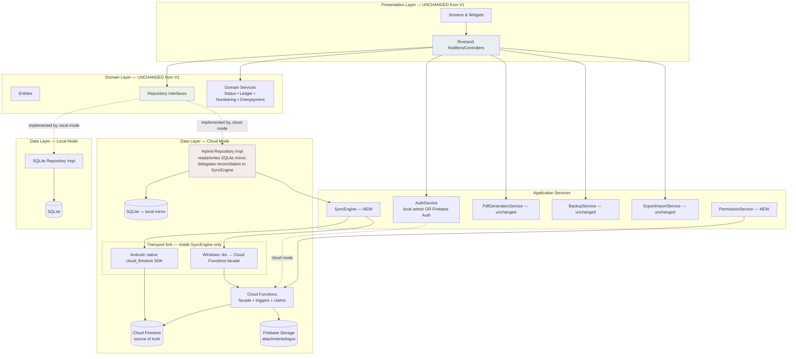

# PayMe — Version 2 Architecture Document
### From Offline-First Desktop Tool to Cloud-Enabled Multi-User Accounting Application

**Version:** 2.0 (design output)
**Author role:** Principal Software Architect
**Audience:** Solo developer, evolving a released V1 product with real users
**Companion documents:** `PayMe_Architecture.md` (V1, preserved as the source of truth for everything not explicitly changed here), `PayMe_Development_Roadmap.md` (V1, extended in Section 22 below)

---

## 1. Executive Summary

Version 1 is a single-user, offline-first Flutter app: one admin, one SQLite file, no network. Version 2 keeps that entire application intact and adds a second, optional mode of operation — **cloud-synced, multi-user, role-and-visibility-gated** — on top of it, using Firebase as the cloud backend. The guiding principle carried over from V1 unchanged: **the Repository interface is the seam.** Everything above it (Presentation, Domain Services, Application Services) does not change. Everything below it does.

Three judgment calls in this document depart from, or sharpen, what was requested in the brief. They are surfaced here up front rather than buried, in the same spirit as V1's "challenge every default" posture:

| # | Brief said | This document recommends | Why |
|---|---|---|---|
| 1 | Firebase should be usable identically via `FirebaseXRepository` implementations on both platforms | **Firestore's official client SDK is not production-supported on Windows.** Android talks to Firestore directly; Windows talks to a small Cloud Functions HTTPS facade backed by the Admin SDK. Both sit behind the *same* repository interface. | This is a verified, current constraint (Section 4), not a stylistic preference — building on the assumption that `cloud_firestore` "just works" on Windows would put the highest-value, highest-liability platform (the office desktop, used by accountants handling money) on an unsupported foundation. |
| 2 | Repositories should switch wholesale between a SQLite implementation and a Firebase implementation | **Neither pure implementation is correct for offline-first multi-user.** A pure-SQLite repo can't see other users' changes; a pure-Firestore repo can't work offline predictably on Windows and duplicates V1's local-database investment for no reason. The correct shape is a **hybrid repository**: always reads/writes local SQLite (unchanged schema), backed by a `SyncEngine` that reconciles with Firestore. | Directly answers the brief's own question ("should there be a hybrid synchronization architecture?") — yes, and it's not optional once Windows can't hold a live Firestore connection anyway. |
| 3 | Each client document should carry a `visibleTo` list | **Correct instinct, incomplete scope.** Firestore has no server-side joins, so a security rule or query that only checks `clients/{id}.visibleTo` cannot restrict a *list query* over `invoices` or `payments` — those collections need the same visibility data on their own documents. | Denormalizing `visibleTo` onto every invoice, payment, and attachment (kept in sync by a Cloud Function) is standard, necessary Firestore practice — not an embellishment. Section 8 explains the mechanism. |

Everything else in the brief is accepted as stated and designed in the sections that follow: Firebase Authentication, per-user/per-client visibility, roles and permissions, Firestore as the multi-user source of truth, audit logging, notifications, and a phased, non-breaking migration path for V1's existing installed base.

**What does not change:** Clean Architecture layering, Riverpod as the sole DI/state mechanism, the `Result<T>` error model, the flattened middle layer (still no use-case-per-action classes), the SQLite schema (the sync-readiness columns added in V1 — `remote_id`, `synced_at`, `is_dirty` — turn out to be exactly the columns this design needs), PDF generation, and the general folder structure. **What's new:** Firebase Authentication, Firestore, Cloud Functions, Firebase Storage, a `SyncEngine`, a permissions/visibility model, and — for Windows only — a REST-shaped facade in front of Firestore.

---

## 2. Architecture Overview

PayMe V2 runs in one of two modes, chosen at first-run setup and stored in `business_settings`:

- **Local mode** (V1, unchanged): single admin, SQLite only, no network, no Firebase project required. This is not a legacy mode being phased out — it remains a fully supported, first-class configuration for a business that wants exactly what V1 offered.
- **Cloud mode** (V2, new): the business has a Firebase project; multiple named users log in with Firebase Authentication; data lives in Firestore as the source of truth; each device keeps a local SQLite mirror for offline use and instant reads; a `SyncEngine` reconciles the two.

A business cannot run both at once, and switching **local → cloud** is a one-time, explicit, user-triggered migration (Section 18) — not something that happens silently. There is no supported path **cloud → local** beyond a manual export, since that would mean discarding other users' access by definition.

The architectural bet this document makes is: **don't build two different apps.** The same `domain/`, the same Notifiers, the same screens run in both modes. What differs is which `RepositoryImpl` Riverpod wires up, and — inside the cloud-mode repositories — an internal fork between "talk to Firestore directly" (Android) and "talk to the Cloud Functions facade" (Windows), which is invisible above the repository boundary.

---

## 3. High-Level Diagram (Textual)



**Reading the diagram:** the box that changed shape the most is the Data Layer. In V1 it was one implementation of each repository, talking to SQLite. In V2, cloud-mode repositories still talk to SQLite first (for every read, and for the durable record of every write) — the Firestore/Functions/Storage boxes are things the `SyncEngine` talks to *on the side*, not something `NOTIFIERS` or `DOMAIN_SVC` ever see.

---

## 4. System Components

| Component | V1 | V2 | Notes |
|---|---|---|---|
| Local database | `sqflite` / `sqflite_common_ffi` | **Unchanged**, plus it now also serves as the offline mirror in cloud mode | The three sync-readiness columns V1 added "for free" now carry real data. |
| Authentication | Local password + PBKDF2 + recovery key | Local mode: unchanged. Cloud mode: **Firebase Authentication** (email/password) | See Section 6. |
| Multi-user / roles | None (single implicit admin) | **New**, cloud mode only | See Sections 7–8. |
| Cloud database | None | **Cloud Firestore** — source of truth in cloud mode | See Section 10. |
| Server-side logic | None | **Cloud Functions** — claims sync, visibility cascade, audit logging, notification triggers, and the Windows facade | See Sections 9, 13, 15, 16. |
| File storage | Local filesystem (`attachments/`, `logos/`) | Local mode: unchanged. Cloud mode: **Firebase Storage**, local files remain a cache | See Section 11. |
| Push notifications | None | **Firebase Cloud Messaging**, Android only, best-effort supplement to a Firestore-backed notification feed | See Section 16. |

### The Windows/Firestore constraint, stated plainly

As of the current Firebase Flutter plugin releases, `cloud_firestore`'s own package description states it provides "live synchronization and offline support on Android and iOS," and the platform-interface package explicitly states **production use on Windows is not supported** (development-only, via a community-maintained desktop shim). This is not a rumor or a stale limitation — it is the current, stated position of the official packages. Firebase Cloud Messaging has the same gap: there is no supported native Windows push-delivery path.

This single fact drives several downstream decisions in this document:
- Windows cannot hold a live `cloud_firestore` connection in production. Its repository implementation instead calls a small set of Cloud Functions over HTTPS (via `dio` — the same client V1's Section 19 already earmarked for a future REST-backed repository).
- Windows cannot receive FCM pushes. "Real-time" on Windows is **short-interval polling** against the same Cloud Functions facade (Section 13), not a live socket.
- Because Firestore Security Rules are bypassed entirely when Firestore is accessed via the Admin SDK (which is what Cloud Functions use), **the Cloud Functions facade must re-implement the same permission and visibility checks that Security Rules enforce for Android.** This is a real, ongoing maintenance cost — two places to keep in sync — and it's called out again in Section 21 (Risks) with a mitigation.

An alternative considered and rejected: adopting the community Windows-desktop Firestore shim directly in the client, so every platform uses one code path. Rejected because "development only, production not supported" is precisely the kind of foundation a commercial accounting product — one whose entire value proposition is *not losing anyone's financial data* — cannot be built on for its primary desktop platform.


---

## 5. Firebase Services — Evaluation

| Service | Verdict | Why |
|---|---|---|
| **Firebase Authentication** | **Use** | Required for multi-user identity. Email/password matches the brief; session persistence and "remember login" are built in. |
| **Cloud Firestore** | **Use** | The multi-user source of truth. Document model fits the entity shapes well once denormalized for the visibility requirement (Section 8). |
| **Cloud Functions** | **Use** | Required, not optional, for three reasons: (1) custom-claims sync for fast Security Rule checks, (2) the visibility-cascade trigger, (3) the Windows facade. Also the only place audit-log writes should originate (Section 15). |
| **Firebase Storage** | **Use** | Attachments and logos in cloud mode. Same role Local Filesystem plays in V1. |
| **Firebase Cloud Messaging** | **Optional, Android-only** | No supported Windows path. Used strictly as a best-effort "wake the app" push for Android when backgrounded — never the system of record. Firestore's `notifications` collection (Section 16) is that system of record on every platform. |
| **App Check** | **Use** | Cheap, meaningful protection against a copied/modified client hammering Firestore or the Cloud Functions facade directly. Enforced on both Firestore rules and callable Functions. |
| **Remote Config** | **Optional** | Useful later for feature-flagging the cloud-mode rollout itself (Section 18's migration phases can be gated behind a Remote Config flag per business, letting you dark-launch and roll back without an app release) — not required for V2.0 to function. |
| **Firebase Analytics** | **Do not use** | PayMe is an accounting tool, not a consumer app; there is no product decision this would inform that isn't already answerable from Firestore's own data (e.g., "how many businesses are active"). Adds a data-collection surface with no offsetting value. |
| **Crashlytics** | **Optional** | Genuinely useful for a solo developer supporting real users remotely, but it is a monitoring/observability concern, not an architectural one — adopt independently of the V2 timeline whenever convenient, on any version. |
| **Performance Monitoring** | **Do not use, for now** | Overlaps heavily with what `LoggerService` (V1 Section 18) plus manual attention to Firestore read counts (Section 19) already gives you. Revisit only if a specific, unexplained slowness shows up in the field. |

---

## 6. Authentication & Routing Layer

**Cloud mode uses Firebase Authentication, email/password provider, exclusively.** This replaces the *mechanism* of login in cloud mode but not the *concept* — every destructive action still requires re-authentication via the existing `ReauthGuard` pattern (Section 20 of the V1 document), now re-implemented to call Firebase Auth's `reauthenticateWithCredential` instead of comparing a local password hash.

**Authentication Routing Layer:**
To support the multi-tenant architecture without heavy `collectionGroup` queries, V2 utilizes an **Authentication Routing Layer**. 
- A lightweight pointer document is maintained at `users/{uid}`.
- This pointer contains only routing metadata (`businessId`, `roleId`, `updatedAt`, `schemaVersion`). **It is strictly a routing pointer and not a domain model.**
- Canonical user data exclusively resides under `businesses/{businessId}/users/{uid}`.
- During app startup, the `FirebaseBootstrapScreen` reads this pointer to resolve the user's tenant. If found, it automatically provisions the local SQLite database with the canonical user and role data, bypassing the bootstrap form.
- **Fail-Closed Security:** If the routing pointer exists but the canonical domain data is missing or corrupted, the app enters a dedicated error state, blocking access and preventing accidental duplicate business creation.

**Why the offline Recovery Key is retired in cloud mode, not extended:** V1's Recovery Key exists because there is no server to ask "who are you" — the entire premise is offline, single-device, single-admin. Cloud mode inverts that premise: a server (Firebase Auth) already exists, and it already provides a safe, standard password-reset-via-email flow that every user can use independently, without depending on whoever holds a Recovery Key. Layering a second, parallel offline recovery scheme on top of Firebase Auth would be two account-recovery systems solving the same problem — exactly the kind of duplicated ceremony this project's own philosophy rejects. **Local mode keeps the Recovery Key exactly as V1 designed it, unchanged**, since local mode has no server to fall back on.

**Session persistence / "remember login":** Firebase Auth's SDK persists sessions locally by default on Android; on Windows, session persistence is handled through the same Cloud Functions facade path — the ID token and refresh token are stored via `flutter_secure_storage` (already a V1 dependency) and refreshed on launch. This means Windows re-authentication doesn't require a network round trip on every app start, only a token refresh, which is cached and retried gracefully if temporarily offline (the app opens read-only against the local SQLite mirror in that case — see Section 12).

**Riverpod integration:**
```dart
final authStateProvider = StreamProvider<AppUser?>((ref) {
  final authService = ref.watch(authServiceProvider);
  return authService.authStateChanges(); // wraps FirebaseAuth.authStateChanges() in cloud mode,
                                          // or a simple local Stream in local mode
});
```
A single `authStateProvider` exists regardless of mode; `AuthService` is the seam (same pattern as every other cross-cutting concern in this document). `go_router`'s top-level `redirect` — already present in V1 — watches this provider; no routing logic changes shape, only what it watches underneath.

---

## 7. Authorization

Authorization is evaluated at three points, deliberately overlapping for defense-in-depth rather than relying on any single one:

1. **UI level (convenience, not security):** screens/buttons hide actions the current user's permission set doesn't include, via a `PermissionService.can(permission)` check read from the current user's resolved permission map (role defaults + overrides, Section 8). This exists purely so users aren't shown controls that will fail — it is never the only gate.
2. **Firestore Security Rules (the real gate for Android/direct-client access):** every read and write rule checks the caller's custom claims (Section 9) and, for client-scoped data, the `visibleTo` map on the document itself.
3. **Cloud Functions facade (the real gate for Windows access):** since Functions use the Admin SDK and bypass Security Rules entirely, every facade function re-implements the same two checks in code before touching Firestore.

Point 1 can be wrong without causing harm (a hidden button that would have failed anyway). Points 2 and 3 cannot both be wrong at once without a real vulnerability — this is why Section 21 treats keeping them in lockstep as a named, tracked risk with an explicit mitigation (a shared test matrix), not an afterthought.

---

## 8. Roles & Permissions

**Roles** (`roles` collection): `super_admin`, `admin`, `user` ship as system roles; the model supports adding more later without a schema change.

- `super_admin`: cannot be deleted or demoted; implicitly holds every permission regardless of what's stored (checked as a special case, not by listing every permission — a growing permissions catalog should never risk accidentally under-provisioning the one role that must never be locked out).
- `admin`: holds a large default permission set; deletable only by a `super_admin` (enforced both in Security Rules and in the Functions facade, per Section 7's dual-gate principle).
- `user`: holds a minimal default permission set (typically: view/create on Clients, Invoices, Payments; nothing on Users, Roles, Backup, Settings) — tuned per business at setup, not hardcoded.

**Permissions are individually configurable, as requested — but modeled as deltas, not a full matrix per user.** Each `users/{uid}` document stores only `permissionOverrides: { permissionKey: bool }` for the *exceptions* to their role's defaults, e.g. `{ "invoices.delete": false }` for a `user` whose role would normally grant it. A brand-new user with no overrides simply inherits their role's full default set. This is the same reasoning V1 applied to sync-readiness columns and PDF templates: store the minimum that captures intent, derive everything else. The alternative — writing out a complete permission matrix for every single user at creation time — means a future new permission requires a backfill migration touching every existing user document; the delta model means a new permission just needs a new default on the relevant role(s), and every user picks it up automatically unless they have an explicit override.

**Permission catalog** (`permissions_catalog` collection): one document per permission key (e.g. `clients.view`, `clients.create`, `clients.edit`, `clients.delete`, `invoices.view`, `invoices.create`, `invoices.edit`, `invoices.delete`, `payments.*`, `reports.view`, `backup.create`, `backup.restore`, `settings.edit`, `users.manage`, `roles.manage`, `activity_log.view`, `dashboard.view`). This collection is descriptive (drives the permissions-editor UI and validates that a key exists) — the enforcement itself lives in Security Rules and Function code, which check against a fixed set of known keys rather than trusting whatever is in the catalog at runtime. Adding a future permission is: add a catalog doc, add it to the relevant role defaults, add the one corresponding check in Rules + Functions. No use-case class, no repository change.

**Effective permission resolution** (used identically by the UI convenience layer and by the Cloud Functions facade):
```
effectivePermission(user, key) =
    user.role == 'super_admin' ? true
  : user.permissionOverrides[key] ?? role(user.roleId).defaultPermissions[key] ?? false
```

**Custom claims sync:** a Cloud Function trigger on `users/{uid}` writes (and on the referenced role's writes, since a role's defaults changing affects every user with that role and no override) recomputes this user's *coarse* permission summary and sets it as a Firebase Auth custom claim. Security Rules read `request.auth.token.perms.invoicesCreate` etc. directly — no `get()` call against Firestore inside the rule, which would otherwise cost an extra document read (and associated latency) on every single rule evaluation. The one caveat, stated plainly rather than glossed over: custom claims are embedded in the ID token and only refresh when the client calls `getIdToken(true)` or the token naturally expires (roughly hourly) — so a permission change doesn't take effect on an already-open session instantly. The mitigation is a small `force_refresh` marker document the client listens to per-user, prompting an immediate token refresh when its timestamp changes; this is a well-established pattern for this exact gap, not a novel workaround.


---

## 9. Repository Layer

**Repository interfaces do not change.** `InvoiceRepository`, `ClientRepository`, `PaymentRepository`, `AccountingYearRepository`, `SettingsRepository` keep the exact method signatures from V1 Section 10. This is the entire point of the seam.

**What changes is which implementation Riverpod wires up, and what that implementation does internally:**

```dart
final invoiceRepositoryProvider = Provider<InvoiceRepository>((ref) {
  final mode = ref.watch(appModeProvider); // local | cloud
  final db = ref.watch(databaseProvider);  // SQLite — present in BOTH modes
  return switch (mode) {
    AppMode.local => InvoiceRepositoryImpl(db, ref.watch(invoiceStatusCalculatorProvider)),
    AppMode.cloud => HybridInvoiceRepositoryImpl(
        db,
        ref.watch(invoiceStatusCalculatorProvider),
        ref.watch(syncEngineProvider),
      ),
  };
});
```

`HybridInvoiceRepositoryImpl` reads and writes SQLite exactly like `InvoiceRepositoryImpl` does — same tables, same SQL. The only addition: every write also marks the affected row `is_dirty = 1` and calls `SyncEngine.notifyDirty(table, id)`, a fire-and-forget nudge to attempt a push soon. **Reads never wait on the network.** This is what makes the app still feel like V1 — instant, local, offline-safe — while quietly staying in sync underneath.

**Recommendation on the brief's specific questions:**

| Question from the brief | Answer |
|---|---|
| Should repository interfaces remain unchanged? | Yes — this is the load-bearing decision of the whole document. |
| Should Riverpod providers switch implementations through DI? | Yes, exactly as V1's DI strategy (Section 6) already does for testing — `appModeProvider` is just one more axis to switch on. |
| Should Application Services remain identical? | Mostly. `PdfGenerationService`, `BackupService` are untouched. `AuthService` gains a Firebase-backed implementation behind its existing interface (Section 6). `ExportImportService`'s UUID-based client-matching logic (V1 Section 15) is reused as-is for the one-time local→cloud migration (Section 18) — it was already designed for exactly this kind of "reconcile two datasets by UUID" problem. |
| Should SQLite disappear? | No — it becomes the universal local mirror on **both** platforms, not just a stopgap for the platform that can't run Firestore's SDK. See the rationale below. |
| Should SQLite become a cache? | Yes, in cloud mode — a durable, offline-first cache, not a throwaway one. It's the thing the app actually reads from and writes to; Firestore is what it reconciles against. |
| Should Firestore become the source of truth? | Yes, in cloud mode, for data ownership and conflict resolution purposes — but not for what the UI reads on every frame. |
| Should there be a hybrid synchronization architecture? | Yes — required, not just recommended, once Windows can't hold a live Firestore connection. See below. |

**Why SQLite stays on Android too, instead of just using Firestore's native offline cache there:** it would be architecturally *possible* for Android to skip local SQLite and lean on `cloud_firestore`'s own offline persistence. It is rejected here because it would mean maintaining two genuinely different data-access strategies — one for Android (native SDK + its cache, its own conflict semantics), one for Windows (facade + SQLite mirror + this document's own `SyncEngine`) — for a project built and maintained by one developer. One consistent strategy, exercised identically on both platforms, is less total code and fewer places for the same bug to hide twice. The cost is that Android doesn't get Firestore's realtime listeners "for free" — it uses the same `SyncEngine` as Windows, just over a faster transport (Section 13).

---

## 10. Firestore Data Model

### Collections (flat, top-level — mirroring the SQLite schema 1:1, deliberately)

| Collection | Mirrors SQLite table | Key fields beyond the obvious |
|---|---|---|
| `business_settings/{singleton}` | `business_settings` | `businessId` (see Multi-Tenancy below), `firestoreSchemaVersion` |
| `users/{uid}` | *(new)* | **ROUTING POINTER ONLY**: `businessId`, `roleId`. Not a domain model. |
| `businesses/{businessId}/users/{uid}` | *(new)* | Canonical domain user: `roleId`, `permissionOverrides`, `isActive`, `businessId` |
| `businesses/{businessId}/roles/{roleId}` | *(new)* | Canonical domain role: `defaultPermissions`, `isSystemRole` |
| `permissions_catalog/{key}` | *(new)* | descriptive only, see Section 8 |
| `accounting_years/{id}` | `accounting_years` | `businessId` |
| `clients/{id}` | `clients` | `visibleTo` (map `uid → true`), `businessId` |
| `invoices/{id}` | `invoices` | `visibleTo` (**denormalized from client**, see below), `businessId` |
| `payments/{id}` | `payments` | `visibleTo` (**denormalized**), `businessId` |
| `payment_attachments/{id}` | `payment_attachments` | `visibleTo` (**denormalized**), `storagePath`, `businessId` |
| `activity_logs/{id}` | *(new)* | append-only, client-writes disallowed (Section 15) |
| `notifications/{id}` | *(new)* | `userId`, `type`, `isRead`, `businessId` |

Deliberately **flat, not nested as subcollections.** A nested shape (`clients/{id}/invoices/{id}/payments/{id}`) reads nicely but breaks the two query patterns this app actually needs most: "all invoices for the active accounting year, across every client" (Dashboard, Reports) and "all invoices for one client across the years they've been billed" — both are natural `where()` queries against a flat collection and require awkward `collectionGroup` queries against a nested one. Flat collections also keep the `SyncEngine`'s job simple: one Firestore collection per SQLite table, one mapping function each way, no path-construction logic to keep in sync with the data model.

### Why every document carries `visibleTo`, not just the client

Firestore has no server-side joins. A Security Rule (or a client query) that only inspects `clients/{id}.visibleTo` has no way to filter a `where` query over `invoices` — the invoice documents themselves must carry the information needed to filter them, because that's the only document a query or a rule ever looks at. So: whenever a client's `visibleTo` map changes, a Cloud Function trigger (`onClientVisibilityChange`) copies the new map onto every invoice, payment, and attachment that traces back to that client, in batches of 500 (Firestore's batched-write limit). This is what makes "users who cannot access a client must never see its invoices, payments, reports, or attachments" actually enforceable, rather than merely true of the client record itself.

Every client-side query includes the matching filter (`where('visibleTo.<uid>', '==', true)`), and every Security Rule independently re-checks the same field on the same document. The query-side filter is a courtesy (so a user's list screen doesn't even attempt to fetch what they can't see); **the Security Rule is the actual boundary** — a modified client that omitted the query filter would simply have its read rejected by the rule, not receive unfiltered data.

### Multi-Tenancy

The brief's own default — one Firebase project per accounting office — is the right starting point, and this document doesn't second-guess that part. Where it adds one small, cheap habit is a direct echo of V1's sync-readiness columns: **every document, in every collection, carries a `businessId` field from day one, even though within a single project it is currently always the same constant value.**

This costs nothing today — nothing reads or branches on it while there's only one business per project — and it removes the one thing that would make a future SaaS consolidation (many offices sharing one project) genuinely hard: retroactively stamping an ownership field onto years of live documents across every collection, for every business, all at once, without downtime. With the field already present, a future migration to a shared project is "copy documents into `tenants/{businessId}/...` (or add `businessId` to every composite index and rule condition)," not "find every document everywhere and add a field to it first."

**Recommendation:** ship per-office Firebase projects for V2.0. Revisit shared-project SaaS only if/when there's an actual second or third paying office — at which point it's a data-migration project with a known target shape, not an open architectural question. This mirrors the brief's own instinct and V1's own "add the column now, use it later or never" philosophy exactly.

### Indexing

Firestore auto-indexes single fields; composite indexes are needed for `(accountingYearId, clientId)`, `(accountingYearId, date)`, and `(clientId, date)` on `invoices`/`payments`, to support the Reports screens (V1 Section 9's existing report queries, unchanged in shape) without falling back to client-side filtering of an over-fetched result set — the same discipline V1 already established ("no report performs an unbounded full-table scan"). `firestore.indexes.json` is checked into the same repository as the app and deployed via the Firebase CLI as part of the release process (Section 19), not created ad hoc from console error links.

---

## 11. Storage Structure

Firebase Storage takes over the role V1's local `attachments/`/`logos/` folders play, in cloud mode:

```
gs://<project>.appspot.com/
├── logos/
│   └── business_logo.<ext>
├── attachments/
│   └── <payment_id>/
│       └── <uuid>.<ext>
├── exports/
│   └── <year_export_id>.zip        (temporary, signed-URL download, auto-deleted after 24h)
└── backups/
    └── <backup_id>.zip             (see Section on Backups below)
```

**Naming:** identical convention to V1's local `AppPaths` scheme (UUID filenames, original name kept only as Firestore document metadata) — this means the local↔cloud sync of attachment files is a straight path-mapping exercise, not a redesign.

**Security:** Storage Security Rules mirror Firestore's — a read/download of `attachments/{paymentId}/...` is only permitted if the caller can read the corresponding `payments/{paymentId}` Firestore document (checked via the same `visibleTo`/claims combination). Uploads require the relevant `payments.edit`-equivalent permission claim.

**Cleanup:** deleting a payment (which already cascades to attachment rows locally, per V1 Section 13) triggers a Cloud Function that deletes the corresponding Storage object(s) — Storage does not clean itself up, so this is an explicit, tested responsibility, exactly as V1's `AttachmentFileDatasource` explicitly handles local file deletion today.

**Local caching:** on both platforms, downloaded attachments are cached in the same local `attachments/` folder V1 already uses, keyed by the same UUID filename, so viewing an attachment a user has already opened once works offline.

**Backups, revisited:** V1's ZIP backup (DB + attachments + settings) remains fully supported and is the *only* backup mechanism in local mode. In cloud mode, Firestore's own durability (automatic replication, point-in-time recovery available on the Firebase/GCP side) covers the "don't lose data" concern structurally — but a periodic **export** of the same shape as V1's ZIP (now generated from Firestore rather than SQLite, via a scheduled Cloud Function) is still valuable as a human-portable, business-owned artifact independent of the Firebase project itself, and is recommended to continue rather than be dropped. Both can coexist; they solve different problems (disaster recovery vs. "I want my data in a file I control").

---

## 12. Offline Strategy

Offline behavior is **identical to V1** from the user's point of view, by design: the app reads and writes local SQLite, full stop, whether or not the network is reachable. What's new in cloud mode is that writes are additionally queued for the `SyncEngine`.

- **Fully offline session:** every screen works exactly as V1 does today. Writes accumulate as `is_dirty = 1` rows. Nothing blocks, nothing spins waiting for connectivity.
- **Reconnection:** `SyncEngine` picks up queued dirty rows and pushes them (Section 13); pulls remote changes since the last successful sync and merges them into SQLite.
- **Auth while offline:** a cached Firebase ID token (Section 6) allows the app to open in a read/write-locally, sync-later state even without being able to reach Firebase Auth at that exact moment, distinguishing "can't reach the network right now" from "not logged in."
- **What's explicitly *not* promised:** a user working fully offline for an extended period, on the same records another user has also been offline-editing, will hit the conflict path (Section 13) once both reconnect. This is disclosed to the business at cloud-mode setup time as an expected characteristic of offline-first multi-user software, not hidden as an edge case.

---

## 13. Synchronization Strategy

**Push (local → cloud):**
1. Every write through a `Hybrid*RepositoryImpl` sets `is_dirty = 1` and `updated_at` on the affected SQLite row, then calls `SyncEngine.notifyDirty()`.
2. `SyncEngine`, on a debounced timer and on reconnect, collects all `is_dirty = 1` rows since the last push and sends them:
   - **Android:** directly via `cloud_firestore`'s batched `WriteBatch`, one batch per up-to-500-doc chunk.
   - **Windows:** via `dio` to a single `syncPush` callable Cloud Function, which validates permissions/visibility server-side (Section 7) and performs the equivalent Admin SDK batched write.
3. On confirmed write, the local row is stamped `remote_id` (if newly created — Firestore's own document ID), `synced_at = now()`, `is_dirty = 0`.

**Pull (cloud → local):**
1. `SyncEngine` tracks a per-collection `lastPulledAt` watermark.
2. **Android:** a `snapshots()` listener per relevant collection (filtered by `visibleTo`) delivers changes live; each change is upserted into SQLite by `remote_id`.
3. **Windows:** a `syncPull(since: lastPulledAt)` callable Function returns documents changed since the watermark; polled on an interval (default **15 seconds**, configurable), plus an on-demand "refresh now" the user can trigger manually. This is the direct, honest consequence of Section 4's constraint — Windows gets near-real-time, not literally instant, updates. For an office environment where staff are the ones both creating and consuming this data, a bounded staleness window in the tens of seconds is a reasonable, disclosed trade-off, not a silently degraded experience.

**Conflict resolution:** given the entity model's own invariants (a payment always belongs to exactly one invoice; balances and statuses are always *derived*, never stored — V1 Section 7), most conceivable conflicts are naturally low-stakes: two users editing a client's phone number, or two users each recording a genuine, distinct payment against the same invoice, are not actually in conflict — the second case is simply two rows, and the derived balance recalculates correctly either way. The one field-level conflict that matters is **concurrent edits to the same record's shared fields** (e.g., two users editing the same invoice's description at once). Resolution: **last-write-wins by `updated_at`**, applied uniformly, with the losing edit surfaced to its author as a non-blocking "this was updated by someone else since you last saved — here's the current version" notice rather than silently discarded. This is simple, explainable to a non-technical business owner, and consistent with the project's stated preference for the least ceremony that correctly handles the real cases, rather than a general-purpose CRDT or operational-transform system this app's data model doesn't need.

**Why a hybrid architecture, restated plainly:** a pure repository swap (SQLite *or* Firestore, chosen once at DI time) cannot be offline-first *and* multi-user at the same time — offline means no live view of other users' writes, and reconnecting means reconciling two datasets that diverged, which is exactly what a sync engine is for. The brief's own repository-swap sketch is the right shape for switching *backends* (as V1 Section 19 already anticipated for a Laravel migration); it is not, by itself, sufficient for *simultaneous multi-user offline-first* — that needs the reconciliation layer this section describes, sitting behind the repository interface, invisible to everything above it.

---

## 14. Transactions & Consistency

Firestore's transaction and batch primitives map directly onto V1's existing "orchestration spans repositories" cases (V1 Section 10):

| Operation | Mechanism |
|---|---|
| Record a payment (updates the payment doc; invoice status/balance remain *derived*, never written) | Single document write — no transaction needed, since nothing else is being read-then-written atomically. |
| Delete an accounting year (cascades to invoices → payments → attachments, rows and Storage files) | A Cloud Function performs the cascade server-side using batched writes (chunked at 500) inside a Firestore transaction where reads-then-writes are involved (e.g., "read the list of invoice IDs for this year, then delete them" needs the read and the delete-set to be consistent) — the same shape as V1's `AccountingYearRepositoryImpl.delete()`, just executed against Firestore instead of SQLite, and gated by the same `ReauthGuard` re-authentication requirement client-side before the call is even made. |
| Client visibility change cascading to invoices/payments/attachments | Batched writes inside the `onClientVisibilityChange` trigger (Section 10) — not a transaction, since it's a pure fan-out write with no dependent read. |
| Transfer invoices between clients (a plausible future feature, not in V1) | Would be a transaction: read the invoice, verify it belongs to the source client, write the new `clientId` and a freshly-copied `visibleTo`, all atomically — flagged here as the pattern to follow *if* this feature is ever added, not built now. |
| Restore a backup / import a year export | Local-only operation (writes SQLite directly, exactly as V1 Section 15 describes), followed by a subsequent normal sync push — restoring does not talk to Firestore directly, it re-enters the same dirty-row pipeline as any other local write. |

**Rollback:** Firestore transactions automatically retry on contention and fail atomically (all-or-nothing) — there is no partial-write state to clean up, unlike a hand-rolled multi-step process. Batched writes are also atomic per batch. The one place true multi-batch atomicity doesn't exist (a cascade spanning more than 500 documents, requiring more than one batch) is handled the same way V1 already handles the equivalent local case: each batch commits, and the operation is designed to be safely re-runnable/idempotent if interrupted partway (a year deletion that's interrupted after batch 2 of 3 can simply be re-triggered — the remaining un-deleted documents are still correctly identifiable by their `accountingYearId`).

---

## 15. Audit Logging

`activity_logs` is **append-only and never client-writable.** Security Rules deny all direct client writes to this collection; every entry is written server-side, by a Cloud Function, as a side effect of the operation it's recording (e.g., `onInvoiceWrite`, `onInvoiceDelete`, `onClientVisibilityChange`, `onUserRoleChange`). This is a deliberate integrity choice: if clients could write their own audit entries, a compromised or buggy client could fabricate or simply omit them, defeating the point of an audit trail. Each entry captures `userId`, a denormalized `userDisplayName` (so the log renders without an extra lookup), `action`, `entityType`, `entityId`, a short human-readable `entitySummary` (e.g., "Invoice INV-105"), and `timestamp` — matching the brief's own example exactly ("Ahmed / Deleted Invoice INV-105 / 2026-08-05 / 14:32").

Visibility of the log itself is gated by the `activity_log.view` permission (Section 8), not by per-client `visibleTo` filtering — a user with that permission sees the whole business's log, on the reasoning that log oversight is inherently a cross-cutting administrative concern, and in practice the permission itself is only granted to roles that already have broad visibility.

---

## 16. Notifications

**Firestore's `notifications` collection is the system of record on every platform; FCM is a best-effort supplement, Android only, never load-bearing.** This directly answers the brief's question ("should notifications use Cloud Messaging, Firestore, or both?") — both, but not as equals: an app that never receives a single FCM push still sees every notification, because it's reading `notifications` the same way it reads anything else (a live listener on Android, polling through the facade on Windows, per Section 13's existing pattern — there's no separate mechanism to build here, it reuses the sync engine).

**Population:** Cloud Function triggers create `notifications` documents server-side:
- `onPaymentCreate` → notifies users with visibility into the related client (`payment received`).
- `onInvoiceCreate` → same pattern (`new invoice`).
- `onClientCreate` → notifies admins (`new client`).
- A scheduled Function (daily) scans for invoices that just crossed their `dueDate` unpaid → `invoice overdue`.
- `onPasswordChange` (Firebase Auth trigger) → self-notification only, security-relevant regardless of other visibility rules.

**Delivery:** each notification document additionally triggers an FCM data message to the recipient's registered Android device tokens, if any — purely to prompt the OS to show a local notification/wake the app; the app's own logic never treats "did the push arrive" as something to depend on for correctness, only for latency.

---

## 17. Security Rules

Rules are organized around two composed checks, applied consistently across every business-data collection:

```
function isSignedIn() {
  return request.auth != null;
}

function hasPermission(perm) {
  return isSignedIn() && request.auth.token.perms[perm] == true;
}

function isVisible() {
  return resource.data.visibleTo[request.auth.uid] == true;
}

match /invoices/{invoiceId} {
  allow read:   if isSignedIn() && isVisible();
  allow create: if hasPermission('invoices.create');
  allow update: if hasPermission('invoices.edit') && isVisible();
  allow delete: if hasPermission('invoices.delete') && isVisible();
}
```

- `super_admin` bypasses `hasPermission` entirely via a dedicated `request.auth.token.role == 'super_admin'` short-circuit at the top of every rule block — reflecting the brief's requirement that this role "has every permission" without depending on the permissions catalog staying perfectly in sync with every rule.
- `activity_logs` denies all client writes outright (Section 15); reads require `hasPermission('activity_log.view')` only, no `isVisible()` check (there is no `visibleTo` field on this collection by design).
- `users` and `roles` writes require `hasPermission('users.manage')` / `hasPermission('roles.manage')` respectively, plus an explicit rule clause preventing a non-`super_admin` from ever writing `roleId: 'super_admin'` onto any user document, and preventing deletion of the sole remaining `super_admin` user.
- App Check enforcement (Section 5) is enabled on both Firestore rules and every callable Cloud Function, rejecting requests without a valid attestation token — cheap insurance against a copied/modified client bypassing the app's own UI-level checks.

**The Windows facade caveat, restated once more because it matters:** none of the above rules apply to traffic from the Windows Cloud Functions facade, because Functions use the Admin SDK, which Security Rules do not govern. The facade's own code must independently implement `hasPermission`-equivalent and `isVisible`-equivalent checks before performing any read or write. Section 21 covers how this dual-implementation risk is kept honest.

---

## 18. Migration Strategy

**For new cloud-mode installs (no existing V1 data):** straightforward — Firebase project setup, initial `super_admin` account creation, done. No migration involved.

**For existing V1 users upgrading in place (real data, real users, the actual hard case):**

1. **The app update itself is non-breaking.** A user who installs the V2 app update and never opts into cloud mode sees exactly V1's behavior — local mode is not a stripped-down compatibility shim, it's the same code path V1 always ran, unchanged.
2. **Opting into cloud mode is an explicit, one-time, user-initiated action** ("Enable Cloud Sync" in Settings), never automatic, never silent.
3. **One-time upload:** a `CloudOnboardingService` (new, analogous in shape to V1's `ExportImportService`) reads the entire local SQLite database and uploads every row to Firestore as new documents, reusing the exact UUID-based identity already present on every entity (V1 Section 9's "IDs are TEXT UUIDs, generated client-side" — this is precisely what makes a clean, non-remapped one-time bulk upload possible; V1's Section 15 export/import logic already solved "reconcile a dataset by UUID," and this reuses that same reasoning, just in one direction and against Firestore instead of a second SQLite file).
4. **The existing local admin becomes the first `super_admin`.** Their existing local password is *not* migrated (Section 6 already establishes cloud mode uses Firebase Auth) — they set a Firebase Auth password as part of this same onboarding flow, framed clearly as "your new cloud login," with the old local password remaining valid only if they ever revert to local mode (which, per Section 2, isn't a supported path back once other users exist — so in practice this is a one-way door, disclosed as such before the user confirms).
5. **Default visibility on upload:** every existing client's `visibleTo` map is initialized to `{ <the original admin's new uid>: true }` only — nothing is visible to anyone else until the admin explicitly grants it. This is the safe default; the alternative (everything visible to everyone by default) would silently violate the confidentiality model on day one of cloud mode.
6. **After upload succeeds and is verified**, the local SQLite database transitions from "the database" to "the local mirror" — no data is deleted, the `SyncEngine` simply starts treating it as the target of pulls and the source of pushes going forward.
7. **Rollback:** if onboarding fails partway (network drop mid-upload, etc.), it is safely re-runnable — already-uploaded rows are recognized by their UUID (`remote_id` already stamped) and skipped, rather than duplicated. Nothing about local mode is disturbed until onboarding fully completes.

**Schema versioning across the migration:** `business_settings/{singleton}.firestoreSchemaVersion` plays the same role Section 24 of the V1 document assigns to SQLite's `schema_version` — the app refuses to sync against a Firestore schema newer than it understands, and a Cloud Function-driven migration path is used for any future Firestore schema change, mirroring `MigrationRunner`'s forward-only, never-edit-a-released-migration discipline (V1 Section 24), now applied to Firestore document shape changes instead of SQL `ALTER TABLE` statements.

---

## 19. Deployment Strategy

- **Environments:** at minimum a `dev`/`prod` Firebase project pair, even for a single business, using Firebase CLI project aliases — cheap insurance against testing a Cloud Function change against real user data.
- **Infrastructure as code:** `firestore.rules`, `firestore.indexes.json`, and the `functions/` source live in the same git repository as the Flutter app, versioned together, deployed via `firebase deploy` as an explicit release step — not edited ad hoc from the Firebase console, for the same reason V1 treats hand-edited production migrations as the single biggest source of "works on my machine" bugs (V1 Section 24).
- **Release coupling:** an app version that depends on a given Firestore schema/rules version should be able to state that dependency explicitly (a minimum `firestoreSchemaVersion` the app requires), so an old app build talking to a newer cloud schema fails safely with a clear "please update" message — the direct cloud-side analogue of `MigrationRunner`'s existing "refuse to open a newer-than-expected database" behavior (V1 Section 24).
- **Android and Windows release cadence** need not be synchronized to each other, since both talk to the same Firestore/Functions backend through their respective repository implementations — a Windows-only bugfix release doesn't require touching the Android build, and vice versa.

---

## 20. Scalability Analysis

| Scale point | Assessment |
|---|---|
| **Office A, 3 employees** | Comfortably within Firestore's normal operating envelope; no document in this model is written more than a handful of times a minute even under heavy concurrent use — well under Firestore's soft per-document sustained-write guidance. |
| **20 offices** | Under the recommended per-office-project model (Section 10), this is 20 entirely independent Firebase projects — no shared quota, no cross-office noisy-neighbor risk, no architectural change required. Operational overhead (20 projects to maintain rules/Functions deploys for) is the real cost here, mitigated by the infrastructure-as-code approach in Section 19 making a deploy identical across all of them. |
| **100 offices** | Same answer as 20 — the model doesn't change shape, only the number of times the same deploy is repeated. This is the strongest argument for the per-project model over a shared-project SaaS design at this stage: it scales by simple repetition rather than by needing new isolation mechanisms as tenant count grows. |
| **Read cost discipline** | The same rule V1 already applies to reports (Section 9: "no report performs an unbounded full-table scan") carries over directly, since Firestore bills per document read: every list/report screen must query with the narrowest filter that satisfies it (by year, by client, by date range), never fetch-broad-then-filter-in-Dart. |
| **Visibility-cascade fan-out** | Bounded by invoices-per-client, which is small in this domain (tens to low hundreds, not millions) — batched at 500 per Firestore's own limit, comfortably fast in practice. |

**If a shared-project SaaS model is ever pursued** (the brief's "later" scenario), the `businessId` field already present on every document (Section 10) is the migration's starting point, not something to be discovered and backfilled under time pressure.

---

## 21. Risks

| Risk | Category | Mitigation |
|---|---|---|
| **`cloud_firestore` has no supported production path on Windows.** | Technical | Addressed structurally throughout this document (Sections 4, 9, 13) via the Cloud Functions facade — not a residual risk so much as the design's central constraint. Re-verify this status before each major Firebase SDK upgrade, since it is the one external fact this entire document depends on. |
| **Dual permission/visibility enforcement (Security Rules for Android, Cloud Functions code for Windows) can drift out of sync.** | Security | Maintain one documented permission-and-visibility test matrix (every permission × every visibility scenario) exercised as automated tests against *both* the Rules emulator and the Functions facade — not shared code (the two run in different languages/runtimes), but a shared specification with parity enforced by tests, not by memory. |
| **Windows realtime is polling, not push (15s default interval).** | UX / Product | Disclosed up front as a known trade-off, not silently degraded; interval is configurable per deployment if a business's usage pattern warrants tighter or looser polling. |
| **Firestore read costs scale with query breadth, not with "how much the user actually needed."** | Cost | The narrow-query discipline in Section 20, applied consistently, particularly on Dashboard/Reports screens. |
| **Offline conflict resolution is last-write-wins, not field-level merge.** | Data integrity | Acceptable given the entity model's own invariants (Section 13) make most real conflicts additive, not overwriting; the one genuine overwrite case surfaces a non-silent notice to the losing editor. |
| **Existing V1 users' one-time cloud-onboarding migration is a real-data, no-do-over event for the first upload.** | Migration | Idempotent-by-UUID re-runnability (Section 18) turns "no do-over" into "safely retryable," and local mode remains fully intact and untouched until onboarding fully succeeds. |
| **Firebase project sprawl at 20–100 offices increases *operational*, not architectural, load.** | Scalability / Ops | Infrastructure-as-code deploys (Section 19) make the marginal cost of the Nth project close to the cost of the first. |
| **Firebase Cloud Messaging and Firestore's official offline persistence guarantees are themselves subject to change by Google over a multi-year horizon.** | Vendor / Platform | No different in kind from V1's own package-maintenance risk note (V1 Section 22: "pinning versions and reviewing changelogs before upgrading") — extended here to cover Firebase BoM version pins specifically, given how directly this document's Windows-facade design depends on the *current* stated platform-support boundaries. |

---

## 22. Recommended Development Roadmap

Continuing V1's existing numbering (V1 Phases 0–15, unchanged) rather than renumbering — each new phase below leaves the app in a runnable state, exactly as V1's roadmap already establishes as the standard:

| # | Phase | Depends on | Notes |
|---|---|---|---|
| 16 | Firebase project scaffolding (dev + prod), Cloud Functions project skeleton, App Check | 15 | No app-code changes yet — infrastructure only. |
| 17 | `AppMode` (local/cloud) + Firebase Authentication behind the existing `AuthService` interface | 16 | Local mode remains the default; cloud mode is opt-in from here on. |
| 18 | `roles`/`permissions_catalog`/`users` collections + custom-claims sync Cloud Function | 17 | |
| 19 | Client visibility model (`visibleTo`) + `onClientVisibilityChange` cascade trigger | 18 | |
| 20 | `SyncEngine` core: dirty-row tracking, push/pull for Android via native `cloud_firestore` | 19 | The highest-risk, most novel piece — build and stabilize on Android alone first. |
| 21 | Cloud Functions facade (`syncPush`/`syncPull` callables) + Windows repository fork | 20 | Reuses the same `SyncEngine` contract; only the transport differs. |
| 22 | Conflict-resolution surfacing (last-write-wins notice) | 20–21 | |
| 23 | Audit logging (server-side triggers) + Activity Log screen | 18 | Independent of the sync engine work; can run in parallel with 20–22. |
| 24 | Notifications (`notifications` collection, triggers, FCM supplement) | 19 | Also independent of 20–22; safe to reorder earlier if desired. |
| 25 | Firebase Storage for attachments/logos, local-cache-on-download | 21 | |
| 26 | `CloudOnboardingService` (one-time V1→V2 upload path for existing users) | 21, 25 | Build and test last among the core features — it operates on real, irreplaceable user data. |
| 27 | Security Rules + Functions-facade permission-parity test suite | 18–21 | Do not consider cloud mode release-ready without this in place, per Section 21. |
| 28 | Hardening, field-load testing against a realistic multi-office dataset, packaging & release for cloud mode | 22–27 | Mirrors V1 Phase 14/15's own spirit — close every gap opened for velocity in the phases above. |

Phases 23–24 (Audit Log, Notifications) are, like V1's Phases 8–11, the safest to reorder relative to each other and relative to the sync-engine work — neither blocks nor is blocked by it. Phase 26 (existing-user migration) should not be pulled earlier than shown, for the same reason V1 keeps Backup/Export last: it is the most consequential, least reversible feature in this entire document, and benefits most from being built against a sync engine that has already been exercised in Phases 20–22.
