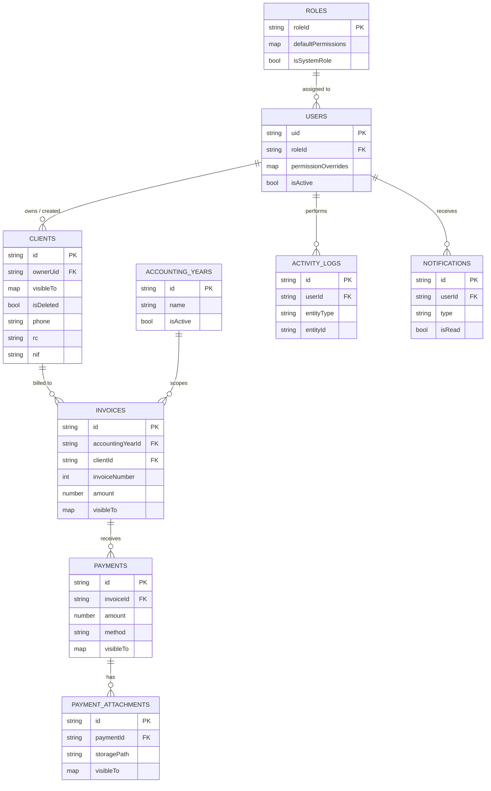

# PayMe — Version 2 Database Design Document

**Status:** Design output. Depends on the approved `PayMe_V2_Architecture.md` (frozen) and the unchanged `PayMe_Architecture.md` (V1, SQLite schema, Section 9).
**Scope:** Cloud Firestore data model for cloud mode only. Local mode's SQLite schema is unchanged from V1 and is not repeated here except where a field's meaning depends on its SQLite counterpart.
**Not in scope:** Implementation code, Flutter code, Firebase SDK code, Security Rules syntax, Cloud Functions code. Where rule *logic* is described, it is to specify which fields it depends on, not to write the rule.

---

## 1. How to Read This Document

Every collection below is one Firestore top-level collection, flat (per V2 Architecture Section 10 — deliberately not nested as subcollections, to keep query patterns and the `SyncEngine`'s per-table mapping simple). Each collection mirrors exactly one SQLite table from V1 Section 9, plus four collections that are new in V2 (`users`, `roles`, `permissions_catalog`, `notifications`) and one that is new and Firestore-only (`activity_logs`).

For every collection this document specifies, in order: **Purpose**, **Document ID strategy**, **Fields**, **Validation rules**, **Indexes**, **Relationships**, **Lifecycle / soft-delete strategy**.

A short note on three items from the originating brief that do **not** get their own top-level Firestore collection, so the mapping is explicit rather than silently dropped:

| Brief mentioned | Where it actually lives in this design | Why |
|---|---|---|
| `sync_queue` | Not a Firestore collection. It is the `is_dirty = 1` rows already tracked in the local SQLite mirror (V1 Section 9's `remote_id`/`synced_at`/`is_dirty` columns), per V2 Architecture Section 13. | The sync queue is a local, per-device concept. A Firestore collection for it would need its own sync logic — the exact duplication the hybrid architecture is designed to avoid. |
| `sessions` | Not a Firestore collection. Session persistence is Firebase Auth's ID/refresh token, cached via `flutter_secure_storage` (V2 Architecture Section 6). | Firestore session documents would be a second, redundant session store; Firebase Auth already owns this. |
| `exports` (as a collection) | Export **artifacts** live in Firebase Storage (`exports/` prefix, Section 11 below). No Firestore document is required to track them, since each is a self-contained, time-limited ZIP addressed by its own path. | Matches V1's export model — a file, not a database row. |
| `audit_logs` | This is `activity_logs` (the name the V2 Architecture already uses in Sections 10 and 15). Naming kept consistent with the frozen architecture rather than introducing a second name for the same collection. | Avoids two names for one concept. |

---

## 2. Global Conventions

These apply to every collection unless a collection's section says otherwise.

- **IDs are client-generated UUIDv4 strings**, matching V1 Section 9's SQLite convention (`id TEXT PRIMARY KEY`, "IDs are TEXT UUIDs, generated client-side"). This is what makes the one-time upload in V2 Architecture Section 18 a clean, non-remapped bulk write, and what lets a document's Firestore ID equal its SQLite `id` — no separate `remote_id`-to-document-ID indirection is needed for documents created after cloud mode begins. (`remote_id` on the SQLite side still matters for the *first* upload of pre-existing V1 rows, whose local `id` becomes the Firestore document ID directly — see Section 18 of the Architecture doc.)
- **`businessId` is present on every document in every collection**, always the same constant value within a project today (V2 Architecture Section 10, "Multi-Tenancy"). Every index and rule below includes it as a matter of habit even though it isn't discriminating anything yet — this is the field that makes a future shared-project SaaS migration additive rather than a backfill.
- **Timestamps are Firestore `Timestamp` fields**, not strings — unlike V1's SQLite `TEXT` ISO-8601 columns. The `SyncEngine`'s mapping layer is responsible for the one conversion this implies each direction; this is a mapping-function concern, not a schema concern, and is noted here so no future reader assumes the two stores use identical wire formats for dates.
- **Booleans as visibility maps**, not arrays: `visibleTo` is a `map<string, bool>` keyed by `uid` (e.g. `{ "uid123": true }`), not a `list<string>` of UIDs. Security Rules can index into a map field cheaply (`resource.data.visibleTo[uid] == true`); testing array membership in a rule is comparatively expensive and doesn't support the single-field index Firestore needs for the query-side filter. This is the concrete mechanism behind V2 Architecture Section 10's `visibleTo` design.
- **Every document that participates in sync carries the Sync Metadata block** (Section 4 below) in full. Every document that participates in visibility carries `visibleTo` and `businessId`. A collection's field table marks which blocks apply.

---

## 3. Collection Overview

| Collection | Mirrors SQLite table | New in V2 | Carries `visibleTo` | Carries Sync Metadata | Client-writable |
|---|---|---|---|---|---|
| `business_settings/{singleton}` | `business_settings` | No | No | Yes | Yes (`settings.edit` permission) |
| `roles/{roleId}` | — | Yes | No | Yes | No (server-managed; seeded at onboarding, edited only via admin UI → Function) |
| `permissions_catalog/{key}` | — | Yes | No | No (descriptive only, Section 8 of Architecture) | No |
| `users/{uid}` | — | Yes | No | Yes | Partial — see Section 4.4 below |
| `accounting_years/{id}` | `accounting_years` | No | No | Yes | Yes (`settings.edit`-equivalent) |
| `clients/{id}` | `clients` | No | **Yes (origin)** | Yes | Yes (per `clients.*` permission) |
| `invoices/{id}` | `invoices` | No | **Yes (denormalized)** | Yes | Yes (per `invoices.*` permission) |
| `payments/{id}` | `payments` | No | **Yes (denormalized)** | Yes | Yes (per `payments.*` permission) |
| `payment_attachments/{id}` | `payment_attachments` | No | **Yes (denormalized)** | Yes | Yes (per `payments.edit`-equivalent) |
| `activity_logs/{id}` | — | Yes | No | No (append-only, has its own minimal metadata — Section 4.10) | **No — server-only** |
| `notifications/{id}` | — | Yes | No | Yes | **No — server-only** (client may update `isRead` only) |

---

## 4. Collection Designs

### 4.1 `business_settings/{singleton}`

**Purpose:** One document per business, holding the same configuration V1's single-row SQLite table holds, plus the fields cloud mode needs to know which schema version it's speaking and which mode the business is in.

**Document ID strategy:** Fixed literal ID, `singleton`. There is exactly one document in this collection per Firebase project, matching V1's `CHECK (id = 1)` single-row constraint.

**Fields**

| Field | Type | Required | Default | Notes |
|---|---|---|---|---|
| `businessId` | string | Yes | — | See Section 2. |
| `businessName` | string | No | `null` | |
| `address` | string | No | `null` | |
| `phone` | string | No | `null` | |
| `email` | string | No | `null` | |
| `logoStoragePath` | string | No | `null` | Path under `logos/` (Section 6). Replaces V1's local `logo_path`. |
| `currencyCode` | string | Yes | — | ISO 4217 code; locked after first invoice (see `currencyLockedAt`). |
| `currencyLockedAt` | timestamp | No | `null` | Set once, on first invoice creation; never cleared. |
| `appMode` | string enum (`local`, `cloud`) | Yes | `local` | Chosen at first-run setup (Architecture Section 2). |
| `firestoreSchemaVersion` | integer | Yes | current version at deploy time | The cloud-side analogue of SQLite's `schema_version` (Architecture Section 18/19). The app refuses to sync against a version newer than it understands. |

**Validation rules:** `currencyCode` must be a recognized 3-letter code; once `currencyLockedAt` is set, `currencyCode` becomes immutable (enforced in Rules/Functions, not just UI). `firestoreSchemaVersion` is never decremented.

**Indexes:** None needed — single document, fetched by fixed ID.

**Relationships:** None (root configuration).

**Lifecycle:** Never deleted. Created once during cloud-mode onboarding (Architecture Section 18) or fresh cloud-mode setup.

---

### 4.2 `roles/{roleId}`

**Purpose:** Defines the default permission set for a named role, per V2 Architecture Section 8. Backs the "grow the permission model without a schema change" requirement.

**Document ID strategy:** Human-readable slug for system roles (`super_admin`, `admin`, `user`); UUID for any future custom role a business defines.

**Fields**

| Field | Type | Required | Default | Notes |
|---|---|---|---|---|
| `businessId` | string | Yes | — | |
| `name` | string | Yes | — | Display name. |
| `isSystemRole` | boolean | Yes | `false` | `true` only for the three shipped roles; blocks deletion. |
| `defaultPermissions` | map<string, bool> | Yes | `{}` | Keyed by permission key from `permissions_catalog`. |
| Sync metadata block | — | Yes | — | See Section 5. |

**Validation rules:** A role with `isSystemRole == true` cannot be deleted (checked in both Security Rules and the Functions facade, per Architecture Section 7's dual-gate principle). `super_admin`'s `defaultPermissions` is not consulted at all — the role bypasses permission checks entirely by a dedicated `role == 'super_admin'` short-circuit (Architecture Section 17), so its `defaultPermissions` map is stored for UI display purposes only, never for enforcement.

**Indexes:** Single-field on `businessId` (auto-indexed).

**Relationships:** `users.roleId` references this collection. A write here (specifically, `defaultPermissions` changing) is one of the two triggers that recompute affected users' custom claims (Architecture Section 8).

**Lifecycle:** System roles are seeded once at business onboarding and never hard-deleted. Custom roles (if a business creates any beyond the three shipped) can be deleted only if no `users` document currently references them (checked before delete); no soft-delete flag needed since the reference-count check makes delete safe.

---

### 4.3 `permissions_catalog/{key}`

**Purpose:** Descriptive registry of every permission key that exists, driving the permissions-editor UI and validating that a key referenced elsewhere is real. Per Architecture Section 8, this collection is **not** the enforcement source — Rules and Functions check against a fixed, code-level set of known keys. This collection can lag or be edited without creating a security hole; it only affects what the admin UI offers to toggle.

**Document ID strategy:** The permission key itself, e.g. `clients.view`, `invoices.delete`, `payments.create`, `reports.view`, `backup.create`, `backup.restore`, `settings.edit`, `users.manage`, `roles.manage`, `activity_log.view`, `dashboard.view`.

**Fields**

| Field | Type | Required | Default | Notes |
|---|---|---|---|---|
| `label` | string | Yes | — | Human-readable, for the permissions editor. |
| `category` | string | Yes | — | Groups keys in the UI, e.g. `"Clients"`, `"Invoices"`. |
| `description` | string | No | `null` | |

**Validation rules:** None beyond uniqueness of the document ID itself (Firestore enforces this structurally — one document per key).

**Indexes:** None needed; the UI fetches the whole (small, bounded) collection.

**Relationships:** Referenced by key from `roles.defaultPermissions` and `users.permissionOverrides` — a soft reference (a string key), not a Firestore reference field, since neither the Rules language nor the Functions facade validates against this collection at request time (Architecture Section 8).

**Lifecycle:** Grows over time as new permissions are added (each addition: one catalog doc + one role default + one Rules/Functions check, per Architecture Section 8). Never deleted in practice, since a removed key could still exist in old `permissionOverrides` maps; if a permission is truly retired, it is left in the catalog marked inactive rather than deleted (`isActive: boolean`, default `true` — added here as the concrete mechanism for what the Architecture doc leaves as future-proofing).

| Field (addendum) | Type | Required | Default | Notes |
|---|---|---|---|---|
| `isActive` | boolean | No | `true` | `false` hides a retired key from the editor without breaking old override maps that still reference it. |

---

### 4.4 `users/{uid}`

**Purpose:** One document per cloud-mode user, keyed to their Firebase Authentication UID. Holds role assignment, permission deltas, and account status.

**Document ID strategy:** The Firebase Auth `uid` itself — not a separate UUID. This is a deliberate departure from the "everything is a client-generated UUID" convention (Section 2), because the natural, collision-free identifier already exists and using it avoids an extra UID↔document-ID lookup on every permission check.

**Fields**

| Field | Type | Required | Default | Notes |
|---|---|---|---|---|
| `businessId` | string | Yes | — | |
| `displayName` | string | Yes | — | |
| `email` | string | Yes | — | Mirrors the Firebase Auth email; kept here too so it can be read in list/report screens without a separate Auth Admin call. |
| `roleId` | string (ref) | Yes | — | References `roles/{roleId}`. |
| `permissionOverrides` | map<string, bool> | No | `{}` | Deltas only, per Architecture Section 8's `effectivePermission` formula — **not** a full matrix. |
| `isActive` | boolean | Yes | `true` | `false` disables login without deleting history (audit trail, past `createdBy` references, etc. must survive). |
| `lastLoginAt` | timestamp | No | `null` | Updated by a Cloud Function on successful auth, not client-writable. |
| `createdBy` | string (uid) | Yes | — | Who provisioned this user; `null` only for the first `super_admin` created during onboarding. |
| `deletedBy` | string (uid) | No | `null` | See Lifecycle. |
| Sync metadata block | — | Yes | — | See Section 5. `deletedAt` doubles as "deactivated at" — see Lifecycle. |

**Validation rules:**
- A `roleId` of `super_admin` can only ever be set by an existing `super_admin` (Architecture Section 17) — never self-assigned, never assigned by an `admin`.
- The sole remaining `super_admin` user cannot be deactivated or have their role changed away from `super_admin` (Architecture Section 17) — this is checked by counting active `super_admin` users before allowing the write, in both Rules and the Functions facade.
- `permissionOverrides` keys must exist in `permissions_catalog` (soft-validated in the admin UI; not re-validated by Rules, per Section 4.3's enforcement note).

**Indexes:** Single-field on `businessId`, `roleId`, `isActive` (all auto-indexed; no composite needed since admin screens filter by one of these at a time, not combinations, per current UI/UX — see Section 10).

**Relationships:** `roleId` → `roles`. Referenced from every other collection's `visibleTo` map (by `uid`) and from `createdBy`/`updatedBy`/`deletedBy` fields throughout.

**Lifecycle:** **Soft delete only — deactivation, never hard delete.** A user document is never removed once created, because `activity_logs`, `createdBy`, `updatedBy` fields elsewhere permanently reference this `uid`; hard-deleting it would leave dangling references in an append-only audit trail. "Deleting" a user in the UI sets `isActive = false`, stamps `deletedAt`/`deletedBy` (Section 5), and — critically — the corresponding Firebase Auth account is disabled (not deleted) via the Functions facade, so the `uid` remains valid for historical reference resolution but can no longer authenticate. A Cloud Function trigger on this write also recomputes and clears the user's custom claims (Architecture Section 8), and removes their `uid` from any `clients.visibleTo` map they appeared in as a courtesy cleanup (not strictly required for security, since the disabled Auth account can no longer present a valid token anyway).

---

### 4.5 `accounting_years/{id}`

**Purpose:** Direct mirror of V1's `accounting_years` table — scopes invoices to a fiscal year, one of which is "active" at a time.

**Document ID strategy:** Client-generated UUID, identical to the SQLite `id` (Section 2).

**Fields**

| Field | Type | Required | Default | Notes |
|---|---|---|---|---|
| `businessId` | string | Yes | — | |
| `name` | string | Yes | — | e.g. `"2026"`; unique within a business (V1: `UNIQUE`). |
| `isActive` | boolean | Yes | `false` | Enforced-in-application invariant carried over unchanged from V1 Section 9: only one document may have `isActive == true` — enforced by the Functions facade / a transaction that flips the previous active year off in the same write. |
| Sync metadata block | — | Yes | — | See Section 5. |

**Validation rules:** `name` uniqueness within `businessId` (checked before write, since Firestore has no native unique-constraint mechanism beyond document ID). Setting `isActive = true` on one document must atomically clear it on whichever document currently holds it — implemented as a transaction (Architecture Section 14 describes the general pattern for reads-then-writes that must be consistent).

**Indexes:** Single-field on `businessId`. Composite `(businessId, isActive)` if the "find the currently active year" query is ever done via query rather than a cached pointer (`business_settings.activeAccountingYearId` is an acceptable, cheaper alternative worth considering during implementation, though not mandated by the frozen architecture — flagged here as an implementation-time optimization choice, not a design requirement).

**Relationships:** Referenced by `invoices.accountingYearId`. Deleting a year cascades to its invoices → payments → attachments (Architecture Section 14), performed server-side via a Cloud Function using chunked batched writes — never a client-side cascade, since a client cannot safely delete an unbounded number of documents atomically.

**Lifecycle:** Hard delete, matching V1's behavior — but only via the server-side cascading Function described above, gated by `ReauthGuard` re-authentication client-side before the call is made (Architecture Section 14). No soft-delete flag; a deleted year and everything under it is genuinely gone, same as V1.

---

### 4.6 `clients/{id}`

**Purpose:** Global (not year-scoped) record of a business's client. The origin point of the `visibleTo` visibility model — every other visibility-bearing collection's `visibleTo` is copied down from here.

**Document ID strategy:** Client-generated UUID, identical to the SQLite `id`.

**Fields**

| Field | Type | Required | Default | Notes |
|---|---|---|---|---|
| `businessId` | string | Yes | — | |
| `name` | string | Yes | — | |
| `phone` | string | **Yes** | — | Required per business rule (unlike V1's SQLite column, which is nullable — this is a deliberate V2 tightening, since multi-user visibility makes "which client is this" ambiguity between users more costly than in a single-admin V1 install). |
| `address` | string | No | `null` | |
| `email` | string | No | `null` | |
| `notes` | string | No | `null` | |
| `rc` | string | No | `null` | *Registre de Commerce* — Algerian trade register number. |
| `nif` | string | No | `null` | *Numéro d'Identification Fiscale* — tax ID. |
| `nis` | string | No | `null` | *Numéro d'Identification Statistique* — statistical ID. |
| `art` | string | No | `null` | *Article d'Imposition* — tax article reference. |
| `ownerUid` | string (uid) | Yes | creator's `uid` | The user who created the client; distinct from `visibleTo` — an owner always appears in `visibleTo` implicitly (added on create) but ownership itself is not re-derivable from the visibility map alone, so it is stored explicitly. Used for "my clients" filters and for a possible future "transfer ownership" action. |
| `visibleTo` | map<string, bool> | Yes | `{ <ownerUid>: true }` | The origin visibility map (Section 2, Architecture Section 10). Grows as an admin grants additional users access. |
| Sync metadata block | — | Yes | — | See Section 5. |

**Validation rules:** `phone` required and non-empty. `visibleTo` must always contain at least one `true` entry (a client visible to nobody is an unreachable, effectively-orphaned record — blocked at write time). Only a user holding `clients.edit` **and** already present in the current `visibleTo` map may modify `visibleTo` itself (you cannot grant access to a client you cannot see).

**Indexes:** Composite index not required for the client list itself (`where('visibleTo.<uid>', '==', true)` combined with `orderBy('name')` needs a composite index per Firestore's rules for inequality/array-map-key + order combinations — see Section 9). Single-field on `businessId`.

**Relationships:** Referenced by `invoices.clientId`. The **source** for the `onClientVisibilityChange` cascade (Architecture Section 10) that copies `visibleTo` onto every invoice, payment, and attachment tracing back to this client.

**Lifecycle:** **Soft delete**, matching V1 (`is_deleted` column) exactly:

| Field (addendum) | Type | Required | Default | Notes |
|---|---|---|---|---|
| `isDeleted` | boolean | Yes | `false` | Mirrors V1's `is_deleted`. Active and deleted clients are queried as separate lists (`where('isDeleted', '==', false)` vs. `true`), per `UI_UX_Guidelines.md`'s "active and deleted items reside on completely separate screens" pattern. |

A soft-deleted client remains fully intact (its invoices/payments are untouched and remain visible to whoever could already see them) — soft delete here means "hidden from the default client list and blocked from new invoice creation," not "inaccessible." Restoring flips `isDeleted` back to `false`; no data is reconstructed because none was destroyed.

---

### 4.7 `invoices/{id}`

**Purpose:** Mirrors V1's `invoices` table. Year-scoped, client-billed. Carries a **denormalized copy** of its client's `visibleTo` map (Architecture Section 10) since Firestore cannot join across collections inside a query or a Security Rule.

**Document ID strategy:** Client-generated UUID, identical to the SQLite `id`.

**Fields**

| Field | Type | Required | Default | Notes |
|---|---|---|---|---|
| `businessId` | string | Yes | — | |
| `accountingYearId` | string (ref) | Yes | — | References `accounting_years`. |
| `clientId` | string (ref) | Yes | — | References `clients`. |
| `invoiceNumber` | integer | Yes | — | Scoped uniqueness: unique within `(businessId, accountingYearId)`, matching V1's `UNIQUE (accounting_year_id, invoice_number)`. |
| `date` | timestamp | Yes | — | |
| `description` | string | No | `null` | |
| `amount` | number | Yes | — | `>= 0`, matching V1's `CHECK (amount >= 0)`. Currency is implicit — `business_settings.currencyCode`, single-currency per business (V1 Section 9 note: money as a simple decimal, not multi-currency). |
| `dueDate` | timestamp | No | `null` | |
| `notes` | string | No | `null` | |
| `status` | — | — | — | **Not stored.** Remains derived, never persisted, exactly as V1 Section 7 establishes (`InvoiceStatusCalculator` computes `unpaid`/`partiallyPaid`/`paid`/`overpaid` from `amount` vs. `sum(payments)` at read time) — carried into V2 unchanged so status can never drift from the payments that determine it. |
| `visibleTo` | map<string, bool> | Yes | copied from `clients.visibleTo` at creation | Kept in sync by the `onClientVisibilityChange` trigger whenever the parent client's map changes. |
| Sync metadata block | — | Yes | — | See Section 5. |

**Validation rules:** `invoiceNumber` uniqueness within `(businessId, accountingYearId)` — checked via a Cloud Function (a transaction reading the current max/existing numbers before assigning, or a per-year counter document, is an implementation-time choice; the frozen architecture does not mandate one specific numbering mechanism, only that the constraint holds). `amount >= 0`. `clientId` must reference a client the writer can currently see (`isVisible()` check, Architecture Section 17) — you cannot invoice a client you don't have visibility into.

**Indexes:** Composite indexes on `(accountingYearId, clientId)`, `(accountingYearId, date)`, `(clientId, date)` — specified explicitly in the Architecture doc Section 10 to support Reports screens without an unbounded scan. Full list and rationale in Section 9 below.

**Relationships:** `accountingYearId` → `accounting_years`; `clientId` → `clients`. Parent to `payments.invoiceId`.

**Lifecycle:** **Hard delete**, matching V1 (no `is_deleted` column on `invoices` in the V1 schema — soft delete in this app is a `clients`-only concept). Deleting an invoice cascades to its `payments` and their `payment_attachments` (rows and Storage files), performed server-side, gated by `ReauthGuard`, per Architecture Section 14.

---

### 4.8 `payments/{id}`

**Purpose:** Mirrors V1's `payments` table. Always belongs to exactly one invoice; amounts here are what invoice status is derived *from*, never the other way around.

**Document ID strategy:** Client-generated UUID, identical to the SQLite `id`.

**Fields**

| Field | Type | Required | Default | Notes |
|---|---|---|---|---|
| `businessId` | string | Yes | — | |
| `invoiceId` | string (ref) | Yes | — | References `invoices`. |
| `date` | timestamp | Yes | — | |
| `amount` | number | Yes | — | `> 0`, matching V1's `CHECK (amount > 0)`. |
| `method` | string enum | Yes | — | `cash` \| `cheque` \| `bank_transfer`, matching V1's `CHECK (method IN (...))`. |
| `reference` | string | No | `null` | |
| `notes` | string | No | `null` | |
| `visibleTo` | map<string, bool> | Yes | copied from the parent invoice's `visibleTo` at creation | Kept in sync by the same cascade trigger. |
| Sync metadata block | — | Yes | — | See Section 5. |

**Validation rules:** `amount > 0`. `invoiceId` must reference an invoice the writer can currently see. Recording a payment is a single-document write (Architecture Section 14) — no transaction needed, since invoice status/balance are derived at read time, never written back onto the invoice document.

**Indexes:** Single-field on `invoiceId` (auto-indexed) covers "all payments for this invoice." Composite `(clientId, date)` is not applicable here directly (`clientId` is not a field on `payments` — it's reached via `invoiceId`); if a "all payments for this client across invoices" report screen is needed, it queries `invoices` for the client first, then `payments` per invoice, or a denormalized `clientId` copy is added at implementation time as a report-query optimization (flagged, not mandated).

**Relationships:** `invoiceId` → `invoices`. Parent to `payment_attachments.paymentId`.

**Lifecycle:** **Hard delete**, matching V1 (`ON DELETE CASCADE` to attachments locally; the Firestore/Storage equivalent is the Cloud Function cleanup described in Section 6 below). No soft-delete flag.

---

### 4.9 `payment_attachments/{id}`

**Purpose:** Mirrors V1's `payment_attachments` table — metadata for a file attached to a payment (receipt, cheque scan, etc.). The actual bytes live in Firebase Storage (Section 6); this document is the pointer plus display metadata.

**Document ID strategy:** Client-generated UUID, identical to the SQLite `id`.

**Fields**

| Field | Type | Required | Default | Notes |
|---|---|---|---|---|
| `businessId` | string | Yes | — | |
| `paymentId` | string (ref) | Yes | — | References `payments`. |
| `storagePath` | string | Yes | — | Path under `attachments/{paymentId}/{uuid}.{ext}` (Section 6). Replaces V1's local `file_path`. |
| `originalFileName` | string | Yes | — | |
| `fileType` | string enum | Yes | — | `pdf` \| `jpg` \| `png`, matching V1's `CHECK`. |
| `fileSizeBytes` | integer | Yes | — | |
| `visibleTo` | map<string, bool> | Yes | copied from the parent payment's `visibleTo` at creation | Kept in sync by the same cascade trigger. Also independently enforced at the Storage layer (Section 6's Security note) by checking the corresponding Firestore document, not duplicated logic. |
| `createdAt` | timestamp | Yes | — | V1's `payment_attachments` table has no `updated_at`/sync columns (attachments are immutable once uploaded — replacing one means deleting and re-uploading, not editing in place), so this collection carries only `createdAt`, `createdBy`, `deletedAt`, `deletedBy` from the full Sync Metadata block (Section 5), not the full set. |

**Validation rules:** `fileSizeBytes` and `fileType` checked against the same limits V1's local `AttachmentFileDatasource` already enforces (not re-specified here — this document does not redefine V1's file-size/type policy, only where the resulting metadata is stored). `paymentId` must reference a payment the writer can currently see.

**Indexes:** Single-field on `paymentId` (auto-indexed).

**Relationships:** `paymentId` → `payments`. `storagePath` → the actual object in Firebase Storage.

**Lifecycle:** **Hard delete**, matching V1's `ON DELETE CASCADE`. Deleting a payment triggers a Cloud Function that deletes both the Firestore attachment documents and their corresponding Storage objects (Architecture Section 11, "Cleanup") — Storage does not clean itself up, so this is an explicit, tested responsibility, same as V1's local file deletion.

---

### 4.10 `activity_logs/{id}`

**Purpose:** Append-only audit trail. Per Architecture Section 15, this is written **exclusively** by Cloud Functions as a side effect of the operation being recorded — never directly by a client — so a compromised or buggy client cannot fabricate or omit entries.

**Document ID strategy:** Auto-generated Firestore document ID (`add()` / auto-ID), since there is no client-side UUID to reuse — the entry is born server-side.

**Fields**

| Field | Type | Required | Default | Notes |
|---|---|---|---|---|
| `businessId` | string | Yes | — | |
| `userId` | string (uid) | Yes | — | Who performed the action. |
| `userDisplayName` | string | Yes | — | Denormalized from `users.displayName` at write time, so the log renders without an extra lookup — and so the log entry still reads correctly even if the user is later deactivated or renamed. |
| `action` | string | Yes | — | e.g. `"deleted"`, `"created"`, `"updated"`. |
| `entityType` | string | Yes | — | e.g. `"invoice"`, `"client"`, `"payment"`, `"user"`. |
| `entityId` | string | Yes | — | The affected document's ID. |
| `entitySummary` | string | Yes | — | Short human-readable label, e.g. `"Invoice INV-105"` — matches the brief's own example format exactly. |
| `timestamp` | timestamp | Yes | server time | |

**Validation rules:** No client writes permitted under any permission, including `super_admin` (Architecture Section 15/17) — the Function is the only writer. Reads gated by `activity_log.view` permission, with **no** `visibleTo` filtering (log oversight is a cross-cutting administrative concern by design, not per-client scoped).

**Indexes:** Composite `(businessId, timestamp)` descending, for the default "most recent first" Activity Log screen. Optionally `(businessId, entityType, timestamp)` if the screen supports filtering by entity type — an implementation-time addition within the frozen design's spirit, not a departure from it.

**Relationships:** Soft references only (`userId`, `entityId` are plain string fields, not enforced foreign keys — an audit log entry must remain readable even after the thing it describes, or the user who did it, no longer exists).

**Lifecycle:** Never updated, never deleted by the application. (Long-term retention/archival policy, if ever needed, is an operational decision outside this document's scope — nothing in the frozen architecture specifies log rotation.)

---

### 4.11 `notifications/{id}`

**Purpose:** The system-of-record notification feed on every platform (Architecture Section 16); FCM is a best-effort delivery supplement, not a second source of truth.

**Document ID strategy:** Auto-generated Firestore document ID.

**Fields**

| Field | Type | Required | Default | Notes |
|---|---|---|---|---|
| `businessId` | string | Yes | — | |
| `userId` | string (uid) | Yes | — | The recipient. |
| `type` | string enum | Yes | — | `payment_received` \| `new_invoice` \| `new_client` \| `invoice_overdue` \| `password_changed`, per the trigger list in Architecture Section 16. |
| `title` | string | Yes | — | |
| `body` | string | No | `null` | |
| `relatedEntityType` | string | No | `null` | e.g. `"invoice"` — lets a tap navigate to the right screen. |
| `relatedEntityId` | string | No | `null` | |
| `isRead` | boolean | Yes | `false` | The one field a client may write directly (marking as read) — everything else is server-written. |
| `createdAt` | timestamp | Yes | server time | |

**Validation rules:** Client writes restricted to `isRead: true` on a document where `resource.data.userId == request.auth.uid` — a user may only mark their own notifications read, and may not alter any other field. All document creation is server-side only (Cloud Function triggers listed in Architecture Section 16).

**Indexes:** Composite `(userId, isRead, createdAt)` descending — the feed screen's primary query ("my unread notifications, newest first" and "all my notifications, newest first").

**Relationships:** `userId` → `users`. `relatedEntityId` is a soft reference to whichever collection `relatedEntityType` names.

**Lifecycle:** No hard delete from the application in V1/V2's current scope; a business may accumulate a growing feed. (A user-facing "clear old notifications" action, if added later, would be a `isRead`-and-age-based bulk soft-clear, not specified further here since it isn't in the frozen brief.)

---

## 5. Sync Metadata Block

Every document that participates in synchronization (every collection above except `permissions_catalog` and `activity_logs`, which are either descriptive-only or server-append-only) carries this common field set. Defining it once here rather than repeating it eleven times keeps the per-collection tables focused on what's distinctive about each collection.

| Field | Type | Purpose |
|---|---|---|
| `createdAt` | timestamp | When the document was first created. Never changes after write. |
| `createdBy` | string (uid) | Who created it. Immutable. Denormalized alongside `userDisplayName` where a UI needs to render "created by X" without a lookup. |
| `updatedAt` | timestamp | Last-modified time. **This is the field the last-write-wins conflict resolution (Architecture Section 13) compares** — the newer `updatedAt` wins, and the losing edit's author is shown a non-blocking "this was updated by someone else" notice rather than having their edit silently discarded. |
| `updatedBy` | string (uid) | Who made the most recent edit. |
| `deletedAt` | timestamp, nullable | Set at soft-delete time (`clients`) or deactivation time (`users`). `null` for collections that only hard-delete. |
| `deletedBy` | string (uid), nullable | Who performed the soft-delete/deactivation. |

**Deliberately not included, and why:** the brief's suggested list also mentioned `syncVersion`, `deviceId`, `lastSyncedAt`, and `conflictState` as candidate fields. Against the frozen architecture, these do not earn a place on the Firestore document itself:

- **`syncVersion` / a per-document version counter:** the conflict model the Architecture doc specifies (Section 13) is last-write-wins by `updatedAt`, explicitly chosen over a general-purpose CRDT/operational-transform system as more ceremony than this domain's actual conflict cases need. A version counter is the infrastructure a field-level-merge or optimistic-concurrency scheme would need; introducing one here would imply a conflict strategy the architecture document explicitly did not choose. If that decision is ever revisited, this field would be added then, deliberately, not speculatively now.
- **`deviceId` / `lastSyncedAt`:** these are properties of the **local SQLite mirror** on a specific device (V1 Section 9's `remote_id`/`synced_at`/`is_dirty` columns, echoed in Architecture Section 9), not of the canonical Firestore document. A Firestore document doesn't have "a" device — it may have been written from Android, Windows, or another Android device an hour later. Putting a single `deviceId` on the cloud document would be misleading about what the field means. Where "which device last pushed this" matters for debugging, it belongs in the local mirror's own bookkeeping, not the shared source of truth.
- **`conflictState`:** the architecture's conflict handling is a UI-level, one-time notice to the losing editor (Architecture Section 13) — a transient event, not a document property to persist. Storing a `conflictState` field on the document would leave stale state sitting on a record forever after the notice has already been shown and dismissed, with no clear rule for who clears it or when.

---

## 6. Firebase Storage Structure

Reproduced from Architecture Section 11 (frozen) with the naming/security rationale expanded, since it is a required companion to `payment_attachments`, `business_settings.logoStoragePath`, and the backup/export flows.

```
gs://<project>.appspot.com/
├── logos/
│   └── business_logo.<ext>
├── attachments/
│   └── <payment_id>/
│       └── <uuid>.<ext>
├── exports/
│   └── <year_export_id>.zip        (temporary, signed-URL download, auto-deleted after 24h)
└── backups/
    └── <backup_id>.zip
```

**Naming convention:** UUID filenames throughout (matching V1's local `AppPaths` scheme); the original, human-readable filename is kept only as Firestore document metadata (`payment_attachments.originalFileName`), never as the Storage object's own name. This means a file can be renamed by the user in the UI without any Storage object move, and the local↔cloud sync of attachment files is a straight path-mapping exercise.

**Security dependency:** access to `attachments/{paymentId}/...` is gated not by a Storage-native rule alone, but by checking the corresponding `payments/{paymentId}` Firestore document's `visibleTo` map at request time — Storage Security Rules and Firestore Security Rules are separate rule sets, but this one is written to consult the other collection's document, so the two never need to be kept manually in sync as two independent sources of truth about who can see a given payment's attachments.

**Cleanup dependency:** every `payment_attachments` document's `storagePath` is the sole pointer to its Storage object; deleting the Firestore document without also deleting the Storage object (or vice versa) leaves an orphan. The Cloud Function responsible for cascading a payment delete (Section 4.9) is the single place both deletions happen together.

---

## 7. Composite Indexes

| Collection | Index (in query order) | Query it serves |
|---|---|---|
| `invoices` | `businessId, accountingYearId, clientId` | "All invoices for client X in year Y" (Client detail screen, ledger). |
| `invoices` | `businessId, accountingYearId, date` | "All invoices in year Y, ordered by date" (Reports, Dashboard). |
| `invoices` | `businessId, clientId, date` | "All invoices for client X across years, ordered by date." |
| `payments` | `businessId, invoiceId` | "All payments for invoice X" — usually satisfiable by the auto single-field index on `invoiceId` alone; listed here in case a `businessId`-scoped variant is needed once multi-project sharing (Section 10 of the Architecture doc) is ever revisited. |
| `clients` | `businessId, visibleTo.<uid>, name` | Per-user client list, alphabetical — one composite index is needed *per user field path*, which Firestore cannot template; in practice this is served by `where('visibleTo.<uid>', '==', true)` plus a single-field index on `name`, since Firestore does not require a composite index for an equality filter plus a single `orderBy` on a different field unless another inequality is involved. Flagged here as a query-shape note, not a literal index definition, since the exact index requirement depends on the final query as implemented. |
| `activity_logs` | `businessId, timestamp desc` | Activity Log screen, newest first. |
| `activity_logs` | `businessId, entityType, timestamp desc` | Activity Log screen filtered by entity type (optional, implementation-time addition). |
| `notifications` | `businessId, userId, isRead, createdAt desc` | Notification feed, unread-first or all, newest first. |

All of the above are checked into `firestore.indexes.json` in the same repository as the app and deployed via the Firebase CLI as an explicit release step (Architecture Section 19) — never created ad hoc from a console error link.

---

## 8. Security Rule Dependencies

This section states, per collection, which fields a Security Rule (Android/direct-client path) and the Cloud Functions facade (Windows path) must both check — the two independently-implemented gates described in Architecture Section 7. It does not write the rules themselves.

| Collection | Read depends on | Write depends on |
|---|---|---|
| `business_settings` | `isSignedIn()` only (any authenticated business member can read settings) | `hasPermission('settings.edit')` |
| `roles` | `isSignedIn()` | `hasPermission('roles.manage')`; additionally, `isSystemRole == true` blocks delete; only `role == 'super_admin'` may write `roleId: 'super_admin'` onto a user (this check lives on the `users` write, cross-referencing this collection's `isSystemRole`/`name`) |
| `permissions_catalog` | `isSignedIn()` | Not client-writable (seeded/updated by deploy-time data, not runtime writes) |
| `users` | `isSignedIn()` | `hasPermission('users.manage')`; blocked from assigning `roleId: 'super_admin'` unless caller's own role is `super_admin`; blocked from deactivating the last remaining `super_admin` |
| `accounting_years` | `isSignedIn()` | `hasPermission('settings.edit')`-equivalent; the "only one `isActive`" invariant enforced transactionally |
| `clients` | `isSignedIn() && isVisible()` (via `visibleTo`) | `hasPermission('clients.create')` for create; `hasPermission('clients.edit') && isVisible()` for update; `hasPermission('clients.delete') && isVisible()` for (soft) delete |
| `invoices` | `isSignedIn() && isVisible()` | `hasPermission('invoices.create')`; `hasPermission('invoices.edit') && isVisible()`; `hasPermission('invoices.delete') && isVisible()` |
| `payments` | `isSignedIn() && isVisible()` | `hasPermission('payments.create')`; `hasPermission('payments.edit') && isVisible()`; `hasPermission('payments.delete') && isVisible()` |
| `payment_attachments` | `isSignedIn() && isVisible()` | `hasPermission('payments.edit')`-equivalent `&& isVisible()` |
| `activity_logs` | `hasPermission('activity_log.view')`, no `isVisible()` (by design, Section 4.10) | Denied for all clients, unconditionally |
| `notifications` | `resource.data.userId == request.auth.uid` | Create denied for all clients (server-only); update allowed **only** for `isRead`, only on the caller's own document |

`super_admin` bypasses every `hasPermission(...)` check above via the top-of-block short-circuit (Architecture Section 17). App Check is enforced on both Firestore Rules and every callable Cloud Function (Architecture Section 5/17), independent of and in addition to the checks in this table.

---

## 9. Scalability

Reproduced briefly from a data-model perspective; full analysis is Architecture Section 20 (frozen, not re-litigated here):

- Every document in this design carries `businessId`, so a future move from one-project-per-office to a shared-project SaaS model is additive (`tenants/{businessId}/...` restructuring or `businessId`-qualified rules/indexes) rather than a retroactive backfill across live data.
- No collection design here performs or implies an unbounded scan; every list/report query in Section 7 is filtered by the narrowest field available (year, client, or user), consistent with the "no report performs an unbounded full-table scan" discipline this design inherits from V1 Section 9 and the Architecture doc's Section 20.
- Visibility-cascade fan-out (`onClientVisibilityChange` touching every invoice/payment/attachment under a client) is bounded by invoices-per-client, batched at Firestore's 500-write limit — small and fast at the scale this schema is designed for (tens to low hundreds of invoices per client, not millions).

---

## 10. Entity Relationship Diagram



---

## 11. Traceability to the Approved Architecture

Every design decision above resolves to a specific section of the frozen `PayMe_V2_Architecture.md`: collection shape and flatness → Section 10; `visibleTo` denormalization and its trigger → Section 10; permission delta model → Section 8; Security Rules dependency structure → Section 17; sync metadata's relationship to conflict resolution → Section 13; Storage hierarchy and cleanup → Section 11; audit log append-only design → Section 15; notification system-of-record → Section 16; migration/onboarding identity mapping (client-generated UUIDs as document IDs) → Section 18; scalability/multi-tenancy posture → Section 20. Nothing in this document introduces a new architectural decision — schema-level choices not explicitly dictated by the Architecture doc (e.g., the exact composite index for a per-user client list, or whether a per-year invoice-numbering counter document is used) are flagged inline as implementation-time choices consistent with, but not mandated by, the frozen design.
