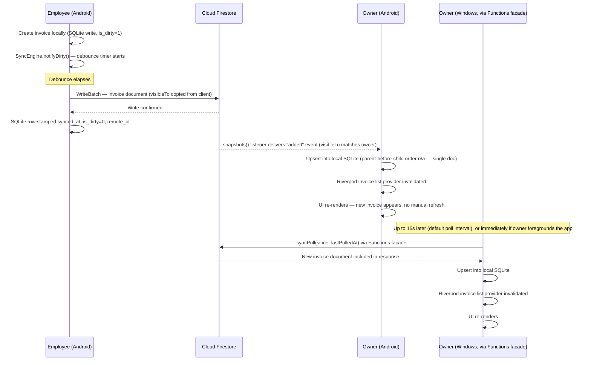
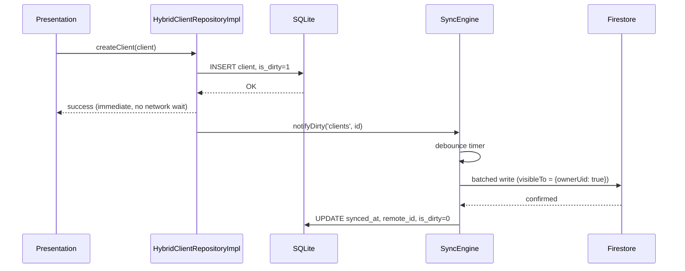
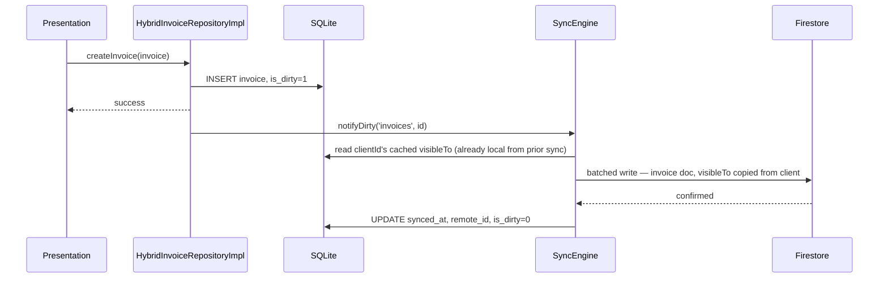
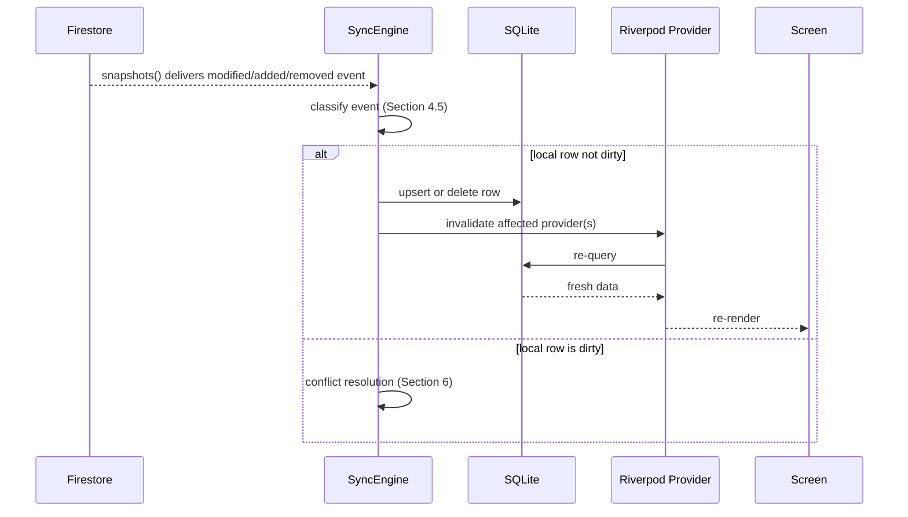
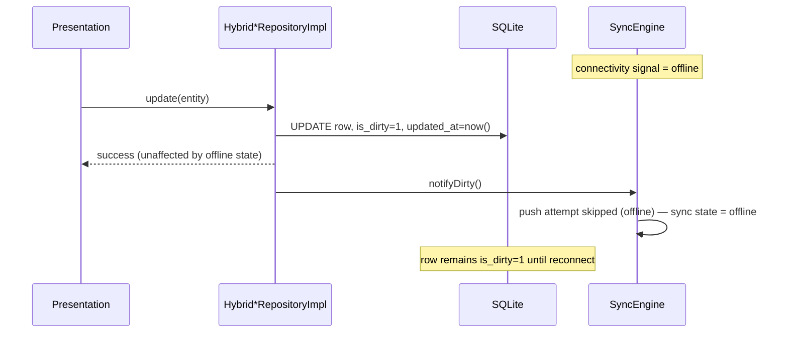
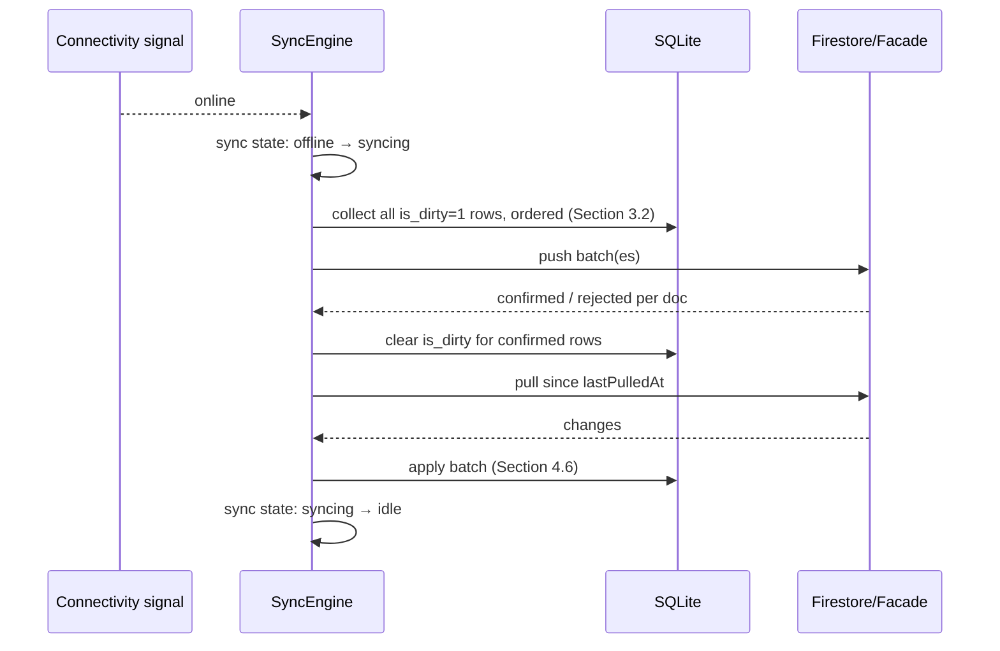
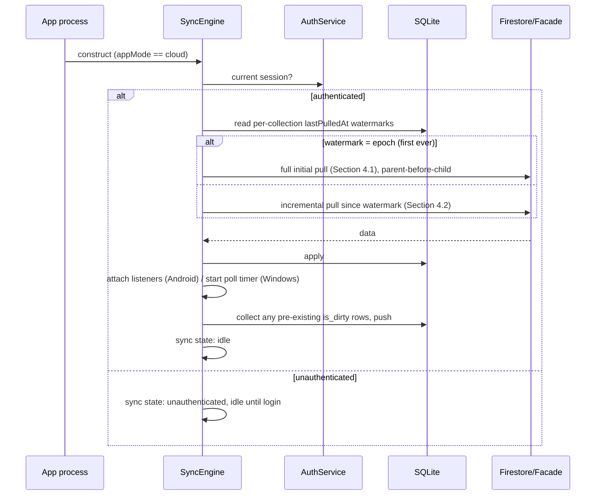

# PayMe — Version 2 Synchronization Design Document

**Status:** Design output. Depends on the approved and frozen `PayMe_V2_Architecture.md`, `PayMe_V2_Architecture_Review.md`, and `PayMe_V2_Database_Design.md`. No architectural decision from those documents is revisited here — this document details the mechanics of the one component the Architecture doc names but does not fully specify: the `SyncEngine`.
**Scope:** Synchronization only — how data moves between the local SQLite mirror and Cloud Firestore/Storage, in both directions, on both platforms, under every connectivity condition. Everything above the repository interface (Presentation, Domain Services, Application Services other than `SyncEngine` itself) is out of scope because it does not change (Architecture Section 3).
**Not in scope:** Flutter code, Firebase SDK code, implementation code of any kind. Where a mechanism is described precisely enough to look like pseudocode, it is describing a *sequence of responsibilities*, not prescribing a syntax.

---

## 1. Synchronization Overview

### 1.1 What synchronization is solving

PayMe V2's central architectural bet (Architecture Section 2) is that cloud mode does not become a different app — it becomes the same offline-first app with a reconciliation layer added behind the repository interface. Every screen, every Notifier, every Domain Service reads and writes SQLite exactly as it did in V1. The `SyncEngine` is the thing that makes that SQLite state eventually match, and stay caught up with, what other users are doing in Firestore — without the Presentation or Domain layers ever being aware that "other users" or "the network" exist.

This document treats that reconciliation layer as its own subsystem with a defined lifecycle, defined states, a push side, a pull side, a conflict policy, and defined failure behavior — because "the `SyncEngine` reconciles the two" (Architecture Section 2) is a one-sentence architectural commitment that an implementer needs considerably more than one sentence to build correctly and consistently across two platforms.

### 1.2 Non-negotiable constraints inherited from the frozen architecture

These are restated here because every design choice in this document must satisfy all of them simultaneously — they are not re-derived, only carried forward:

| Constraint | Source |
|---|---|
| Repository interfaces do not change; `SyncEngine` sits behind `Hybrid*RepositoryImpl`, never called directly by a Notifier. | Architecture Section 9 |
| SQLite is the only thing the UI ever reads from or writes to, in both modes. Reads never wait on the network. | Architecture Section 9, 12 |
| Android talks to Firestore directly via the native SDK; Windows talks to a Cloud Functions HTTPS facade. Both are behind the same `SyncEngine` contract — only the transport differs. | Architecture Section 4, 13 |
| Conflict resolution is last-write-wins by `updatedAt`, deliberately not a CRDT/OT system. | Architecture Section 13 |
| `visibleTo` filtering applies to every pull, on both the query side (courtesy) and the Security Rule / Functions-facade side (the actual boundary). | Architecture Section 10, 17 |
| Windows realtime is polling (default 15s, configurable), not a live socket. | Architecture Section 4, 13 |
| Firestore writes are batched at 500 documents per batch; multi-batch cascades are idempotent and safely re-runnable. | Architecture Section 14 |
| `businessId` is present on every synced document (currently constant, forward-looking for multi-tenant). | Architecture Section 10 |

### 1.3 Document map

Sections 2–4 design the `SyncEngine` itself and its two data pipelines. Sections 5–10 design how it behaves under real-world conditions (offline, conflicts, realtime, and its two storage integrations). Sections 11–14 cover what happens when things go wrong and how the design is validated. Sections 15–17 close with sequence diagrams, risks, and recommendations.

---

## 2. Sync Engine

### 2.1 Responsibilities

The `SyncEngine` is an Application Service (Architecture Section 3's "Application Services" layer, alongside `PdfGenerationService`, `BackupService`) with a narrow, explicit contract:

1. **Detect** which local rows have unsynced changes (dirty-row tracking, Section 8).
2. **Push** those changes to Firestore, on Android directly and on Windows via the Cloud Functions facade, respecting batching and ordering rules (Section 3).
3. **Pull** remote changes the local mirror doesn't yet have, upsert them into SQLite, and do so without ever blocking a read (Section 4).
4. **Surface sync state** (idle, syncing, offline, error) to Riverpod as an observable stream, so the UI *may* show a subtle indicator — without any repository or Notifier needing to know why the state changed.
5. **Own the conflict policy** (Section 6) — resolution is applied at the moment a pulled document's `updatedAt` is compared against the local dirty row's `updatedAt`, entirely inside the engine, never surfaced as a decision the UI has to make in real time.
6. **Own the realtime subscription lifecycle** (Section 7) on Android, and the polling loop on Windows — both are internal transport details behind one conceptual "pull" operation.

What the `SyncEngine` explicitly does **not** do: it does not decide *what* a valid invoice looks like (that's Domain Services / entity validation, unchanged from V1), it does not decide *who* can see what (that's Security Rules / the Functions facade — the engine pushes and pulls only what those layers permit, and treats a rejection as an error to handle, not a policy to enforce itself), and it does not talk to Presentation. It is a peer of `BackupService`, not a peer of a Repository — repositories *call into* it (`notifyDirty()`), they do not extend it.

### 2.2 Dependencies

| Dependency | Direction | Why |
|---|---|---|
| SQLite database handle | `SyncEngine` reads/writes | Source of dirty rows to push; destination for pulled documents. Same handle `Hybrid*RepositoryImpl` uses — one connection pool, no separate sync-only database file. |
| `AuthService` | `SyncEngine` reads | Needs the current user's `uid`/token to authenticate pushes/pulls and to know when to stop syncing (logout) or start (login). |
| Connectivity signal | `SyncEngine` reads | A platform-appropriate "online/offline" stream (not specified further here — a platform detail, not a sync-design decision) that triggers reconnect sync (Section 3.6) and gates whether a push attempt is even made. |
| Firestore SDK (Android) / `dio` HTTP client (Windows) | `SyncEngine` uses | The two transports behind the single `SyncEngine` contract (Architecture Section 4, 13). |
| `appModeProvider` (Riverpod) | `SyncEngine` reads | Cloud mode only; in local mode the engine is never instantiated (Section 2.4). |

The engine does **not** depend on any Notifier, any screen, or any Domain Service — dependencies flow inward toward it (repositories depend on it), never outward from it toward Presentation.

### 2.3 Interaction with repositories

Exactly as specified in Architecture Section 9: `Hybrid*RepositoryImpl` performs the same SQLite read/write a local-mode repository would, then — for writes only — marks the affected row `is_dirty = 1`, stamps `updated_at`, and calls a single fire-and-forget method on the engine, conceptually `notifyDirty(table, id)`. That call does not await a sync; it is a nudge that a push attempt should happen soon (debounced, Section 3.1). Reads never call into the engine at all — a `HybridInvoiceRepositoryImpl.getInvoices()` call is indistinguishable, from the engine's point of view, from a local-mode read, because it is one: it goes straight to SQLite.

This is the seam that keeps synchronization invisible above the repository boundary: a repository's public method signatures are unchanged from V1, and the one line of new behavior on the write path (mark dirty, notify) is internal to the `Hybrid*` implementation, not part of the interface.

### 2.4 Interaction with Riverpod

```
syncEngineProvider          — the engine instance itself, cloud mode only (watches appModeProvider;
                               local mode never constructs it)
syncStateProvider           — StreamProvider<SyncState> exposing the current state (Section 2.6)
                               for optional UI indicators
```

`syncEngineProvider` is what `HybridInvoiceRepositoryImpl` and its siblings (`HybridClientRepositoryImpl`, `HybridPaymentRepositoryImpl`, etc.) receive via constructor injection, mirroring the exact pattern already shown in Architecture Section 9's provider wiring example. `syncStateProvider` is the *only* thing a screen may watch if it wants to show sync status — it is a read-only projection, never a way for the UI to trigger sync logic directly (manual sync, Section 3.2, goes through a method call, not a state mutation).

There is exactly **one** `SyncEngine` instance per app session, shared by every `Hybrid*RepositoryImpl` — not one per repository — so that a single debounce timer, a single connectivity listener, and a single set of Firestore listeners exist per running app, rather than one per entity type competing for the same network resource.

### 2.5 Lifecycle

**Initialization** (app startup, cloud mode only):
1. Riverpod constructs `syncEngineProvider` when first read (lazily, like any other provider) — in practice, forced eagerly at app startup so cold-start sync (Section 3.5) can begin immediately rather than waiting for the first screen that happens to touch a repository.
2. The engine reads `AuthService`'s current session. If no session, it stays in an `unauthenticated` state and does nothing — this is the state during onboarding before the first `super_admin` account exists (Architecture Section 18).
3. Once authenticated, it reads each table's `lastPulledAt` watermark from local storage (a small per-collection bookkeeping table, not user-facing data — see Section 9.5) and begins cold-startup sync (Section 3.5).

**Startup** happens once per app process launch. It is distinct from **reconnect** (Section 3.6), which can happen many times within one running process.

**Shutdown:** on logout, the engine cancels all active listeners/polling timers, clears its in-memory state, and returns to `unauthenticated`. On app termination (process kill, device sleep beyond a platform-specific threshold), no explicit shutdown call is guaranteed — the engine's state is not memory-only for anything that matters (dirty rows are durable in SQLite, watermarks are durable in local storage), so an ungraceful termination loses nothing: the next startup's cold-sync simply resumes from the last durable watermark and the still-dirty rows.

**Restart mid-operation:** if the app is killed mid-push or mid-pull, no partial state needs cleanup on the next launch, because both pipelines are designed to be idempotent and resumable from durable state alone (Sections 3 and 4) — this is a deliberate design property, not an incidental one.

### 2.6 Synchronization states

A small, closed set of states, exposed via `syncStateProvider`:

| State | Meaning | UI implication (optional, per `UI_UX_Guidelines.md`'s resilience principle) |
|---|---|---|
| `unauthenticated` | No signed-in cloud user; engine idle. | No indicator (local-mode-equivalent screens). |
| `idle` | No known dirty rows, no pull in progress, connectivity present. | No indicator, or a subtle "synced" glyph. |
| `syncing` | Actively pushing and/or pulling. | Optional subtle spinner — never a blocking overlay (per the UI guidelines' `LoadingView` usage note: sync is background, not a page-load state). |
| `offline` | Connectivity signal says unreachable. | Optional subtle "offline — changes saved locally" indicator, non-blocking. |
| `error` | Last push or pull attempt failed after exhausting retries (Section 3.4) and is now waiting for the next scheduled attempt or a connectivity change. | Optional non-blocking indicator; never an app-blocking error dialog, since local reads/writes are unaffected. |

Transitions are driven by the engine internally; nothing external sets the state directly. This state machine exists purely for optional UI feedback — no repository or Domain Service ever branches on it, preserving "keep UI completely unaware of synchronization" for everything except this one, intentionally thin, opt-in observability seam.

---

## 3. Push Pipeline

### 3.1 Detecting locally modified entities

Every `Hybrid*RepositoryImpl` write sets `is_dirty = 1` on the affected SQLite row (Architecture Section 9) — this is the entire detection mechanism. There is no separate change-tracking table or write-ahead log to design: V1's own `is_dirty`/`synced_at`/`remote_id` columns (V1 Section 9, carried into V2 unchanged per Architecture Section 4) are sufficient, because every write already goes through exactly one code path (the repository), so there is nowhere a change could occur without also flipping the flag.

`notifyDirty(table, id)` (Section 2.3) does not itself perform work — it resets a debounce timer (default: a few seconds, configurable) so that a burst of edits (e.g., filling out an invoice form field-by-field, if the form autosaves) coalesces into one push cycle rather than one push per keystroke-equivalent write. On timer expiry, or immediately on reconnect (Section 3.6), the engine collects the current set of dirty rows and begins a push cycle.

### 3.2 Queue ordering

Dirty rows are pushed in an order that respects the entity model's own foreign-key direction, so a document never arrives at Firestore referencing a parent that doesn't exist there yet:

1. `clients` (no dependencies)
2. `accounting_years` (no dependencies)
3. `invoices` (depends on `clients`, `accounting_years`)
4. `payments` (depends on `invoices`)
5. `payment_attachments` (depends on `payments`; also depends on its file already being uploaded to Storage — Section 10.1)

Within one table, rows are pushed oldest-`updated_at`-first, so that if a push cycle is interrupted partway, the next cycle naturally continues roughly where the last one left off rather than re-ordering arbitrarily.

This ordering matters most for the **first** push of a given entity (its Firestore document doesn't exist yet); for updates to already-synced entities, ordering is a consistency nicety rather than a strict requirement, since Firestore does not itself enforce foreign-key integrity — but keeping one discipline for both cases is simpler to implement and reason about than two.

### 3.3 Batch uploads

Per Architecture Section 13/14, writes are chunked at Firestore's own 500-document batch limit:

- **Android:** dirty rows collected per push cycle are grouped into `WriteBatch`s of up to 500 operations each, submitted directly via the native SDK.
- **Windows:** the same grouping is sent to a single `syncPush` callable Cloud Function per chunk, which performs the equivalent Admin SDK batched write server-side after independently re-validating permissions and visibility (Architecture Section 13, restating the dual-gate principle from Section 7).

A push cycle with fewer than 500 dirty rows (the overwhelmingly common case for a small accounting office) is one batch. Batching exists for correctness at scale, not because typical usage needs it — it costs nothing to have in place from day one and avoids a redesign the first time an office does a large bulk operation (e.g., an end-of-year cleanup touching hundreds of rows at once).

### 3.4 Retry policy and exponential backoff

A push cycle that fails (network error, transient Firestore/Functions error, rate limiting) is retried with exponential backoff:

- Base delay on first failure, doubling on each consecutive failure, capped at a maximum interval (so the engine doesn't end up retrying once an hour after a long outage — capped backoff plus the reconnect trigger in Section 3.6 together bound the worst case).
- A small random jitter is added to each delay so that, in a multi-user office where several devices lose and regain connectivity together (e.g., a shared office Wi-Fi blip), they don't all retry in the same instant and create a thundering-herd spike against the same Firebase project.
- Backoff state is **per push cycle attempt**, not persisted across app restarts — a fresh app launch begins Section 2.5's cold-startup sync at the base delay, not wherever a previous session's backoff had climbed to. This is a deliberate simplicity choice: persisting backoff state across restarts protects against a failure mode (rapid restart-loop hammering) that is already independently bounded by how often a human actually restarts an app.

### 3.5 Partial failures

A single push cycle can partially succeed — some documents in a batch write, others rejected (e.g., a Security Rule denial on one specific document because its `visibleTo` changed server-side between the local edit and the push, or a stale reference to a client that was deleted by another user in the meantime). Handling:

- **Android (native batched write):** a `WriteBatch` is atomic as a whole per Firestore's own guarantee — if any operation in the batch is rejected, the entire batch fails together. The engine therefore does not submit unrelated entities in the same batch as entities more likely to be rejected (e.g., a batch is grouped by table per Section 3.2, so one client's rejected invoice doesn't also block an unrelated client's payment in the same cycle — they're different batches by construction).
- **Windows (Functions facade):** the facade is designed to report **per-document** results within its single callable response (a document-ID-to-outcome map), since the underlying Admin SDK write inside the Function is not constrained to all-or-nothing the same way a client `WriteBatch` is. This asymmetry between platforms is disclosed here rather than glossed over: Android's failure granularity is "the whole batch," Windows's is "per document" — both are acceptable because a rejected write's SQLite row simply **stays dirty** (Section 3.6) rather than being falsely marked synced, so nothing is lost either way, only retried at different granularity.

A document rejected for a **permanent** reason (e.g., permission genuinely revoked, not transient) is not retried indefinitely — after a bounded number of consecutive rejections for the *same* reason, it is surfaced via the sync-state `error` channel with enough detail for a human to notice, rather than silently retried forever (Section 11 covers this in more depth as an error-recovery scenario, "permission failures").

### 3.6 Transaction boundaries

Per Architecture Section 14, most pushes are simple, non-transactional document writes (a client edit, a new payment) — no read-then-write consistency is needed because nothing on the Firestore side depends on reading current state before writing. The exceptions, where the engine's push must go through the transactional/server-side paths already specified in Architecture Section 14 rather than a plain batched write, are:

- Setting `accounting_years.isActive = true` (must atomically clear the previous active year).
- Any cascade (year deletion, client deletion implications) — these are **not** performed by the push pipeline pushing individual dirty rows at all; they are explicit user-triggered operations that call directly into a Cloud Function (Architecture Section 14), bypassing the ordinary dirty-row queue entirely, because a cascade's consistency requirement (read affected IDs, then delete them all together) cannot be expressed as "several independent rows happened to go dirty at once."

This means the push pipeline described in Sections 3.1–3.5 covers the steady-state case (create/update individual entities); year deletion and other cascades are a **separate, synchronous, user-initiated call path** gated by `ReauthGuard`, not something that flows through dirty-row batching. This distinction matters for an implementer: not every SQLite write in cloud mode goes through "mark dirty, push later" — cascading deletes go through "call the Function now, wait for confirmation, then reflect the result locally."

### 3.7 Idempotency and recovery

Every pushed document's ID is the same client-generated UUID as its SQLite `id` (Database Design Section 2) — so re-sending an already-successfully-written document (e.g., because the app crashed after the server confirmed the write but before the local `is_dirty` flag was cleared) is a harmless overwrite with identical content, not a duplicate. This single property — stable, client-owned IDs — is what makes the entire push pipeline safely re-runnable from an arbitrary interruption point: on any restart, the engine simply looks at whatever is still `is_dirty = 1` in SQLite and pushes it again, with no separate "was this actually sent last time?" bookkeeping required.

On confirmed success, the local row is stamped `synced_at = now()`, `is_dirty = 0`, and — if this was the row's first-ever push — `remote_id` (Architecture Section 13). Confirmation is only trusted from an explicit success response; a request that times out with no response is treated as failed (retried per Section 3.4), never assumed successful, since assuming success on ambiguity is exactly the class of bug that produces silent data loss.

---

## 4. Pull Pipeline

### 4.1 Initial download (cold start, first-ever cloud sync)

The very first pull for a device (first login on that device, or first cloud-mode session ever for a fresh install) has no `lastPulledAt` watermark yet. It is treated as watermark `= epoch` — a full pull of every document the current user's `visibleTo` grants them access to, across every synced collection, ordered by the same table dependency order as Section 3.2 (parents before children), so that by the time an invoice is upserted into local SQLite, its `client_id` foreign key already resolves.

This is the one pull operation expected to move a non-trivial amount of data, and is treated as such in the UI: the app is usable immediately (SQLite is either empty or has prior local-mode data — Section 14 covers the migration case specifically), but a first-run cloud sync may show a light "syncing your data" state rather than pretending it's instantaneous.

### 4.2 Incremental synchronization

Every subsequent pull, on both platforms, is bounded by the per-collection `lastPulledAt` watermark (Architecture Section 13): "documents in collection X changed since timestamp T," never a full re-scan. This is what keeps steady-state sync cheap in both bandwidth and Firestore read-cost terms (Architecture Section 20's "read cost discipline," applied here to sync itself, not just report screens).

- **Android:** the watermark is implicit in how `snapshots()` listeners work — a listener attached once continues delivering only *changes* for as long as it's alive; the watermark is really "was a listener already attached and still is," not a value re-queried each time.
- **Windows:** the watermark is explicit — `syncPull(since: lastPulledAt)` (Architecture Section 13) — and is advanced to the server's response timestamp after each successful pull, not to the client's local clock, to avoid clock-skew-induced gaps.

### 4.3 Realtime listeners (Android)

One `snapshots()` listener per relevant collection, each already filtered server-side by the same `visibleTo`/`businessId` query the initial pull used (Architecture Section 10 — "every client-side query includes the matching filter," restated here as the mechanism realtime listening reuses). A listener delivers three kinds of change events per Firestore's own snapshot semantics: **added**, **modified**, **removed** — mapped in Section 4.5 below onto SQLite upsert/delete operations.

Listener **lifecycle**: attached on successful authentication (part of cold-startup sync, Section 2.5), detached on logout, and — importantly — detached and **re-attached** (not merely left to Firestore's own reconnection handling) whenever the app returns to the foreground after being backgrounded past a short threshold, to guarantee a fresh, consistent snapshot rather than trusting an arbitrarily long-lived connection's internal state. This re-attach-on-foreground behavior is also what implements foreground synchronization (Section 5.5, distinct from a literal cold start).

### 4.4 Polling (Windows)

No persistent connection; a timer fires `syncPull(since: lastPulledAt)` on the configured interval (default 15s, Architecture Section 4/13), plus:
- Immediately on app foreground.
- Immediately on user-triggered "refresh now" (manual sync, Section 5.2).
- Immediately on reconnect detection (Section 5.6).

A poll that finds zero changes is a normal, expected, cheap outcome (one read of an empty result set) — not treated as an error or logged as noteworthy; only a poll that *fails to complete* (network/auth error) enters the retry/backoff path (same policy as Section 3.4, applied symmetrically to pulls).

### 4.5 Snapshot processing — new, updated, and deleted documents

Regardless of transport, every pulled change is one of three kinds, each mapped to a specific local action:

| Firestore change type | Local action |
|---|---|
| **New document** (not present locally by `remote_id`) | Insert a new SQLite row, `is_dirty = 0`, `synced_at = now()`, `remote_id` = the Firestore document ID. |
| **Modified document** | If the local row is **not** dirty: overwrite it with the pulled version (a clean pull-and-apply). If the local row **is** dirty: this is a conflict — hand off to conflict resolution (Section 6) rather than blindly overwriting a pending local edit. |
| **Removed document** (hard-deleted server-side, e.g., an invoice or payment) | Delete the local row. Cascading local children (a deleted invoice's local payments) are removed via the same `ON DELETE CASCADE` SQLite already enforces (V1 Section 9) — the pull pipeline only needs to delete the top-level row the removal event names. |

**Soft-deleted documents** (`clients.isDeleted = true`, Database Design Section 4.6) arrive as an ordinary **modified** event, not a **removed** one — a soft delete is a field change, not a document deletion, so it's processed identically to any other update and simply results in the local row's `is_deleted` flag flipping to match.

### 4.6 Ordering and batch processing

Pulled changes are applied to SQLite inside a single local transaction per batch of incoming changes (not one transaction per document), both for performance (avoiding hundreds of tiny commits) and for consistency (a screen re-reading SQLite mid-pull sees either the old state or the fully-applied new state, never a half-applied batch). Within one transaction, the same parent-before-child ordering from Section 3.2 is applied when a batch mixes entity types (e.g., a pull that includes both a new client and a new invoice referencing it applies the client row first).

---

## 5. Sync Modes

Restating each mode named in the brief as a specific combination of the mechanisms already designed above — this section is a reference index, not new mechanism:

| Mode | Trigger | Mechanism used |
|---|---|---|
| **5.1 Automatic** | Any local write (push side); any listener event or poll tick (pull side). | Sections 3.1 and 4.3/4.4 — this is the default, always-on behavior; "automatic" describes the absence of a user action, not a separate code path. |
| **5.2 Manual** | User taps an explicit "refresh now" / "sync now" control. | Triggers an immediate pull attempt (bypassing the poll timer's wait, Section 4.4) and, if there are currently dirty rows, an immediate push attempt (bypassing the debounce timer, Section 3.1). Exists primarily for Windows, where the default 15s polling interval is a disclosed trade-off (Architecture Section 21) users may want to shortcut. |
| **5.3 Background** | App is backgrounded but the OS has not suspended the process. | Android's `snapshots()` listener continues delivering while the process is alive (subject to OS background execution limits, a platform detail outside this document's scope); Windows's polling timer continues on the same interval. Neither mode attempts new *pushes* aggressively in the background beyond what's already queued, to avoid draining battery/bandwidth for a screen no one is looking at — the debounce timer from Section 3.1 is intentionally not shortened just because the app is foregrounded vs. backgrounded, since push urgency doesn't actually depend on that. |
| **5.4 Realtime** | Continuous, while a listener is attached (Android) or the poll interval elapses (Windows). | Sections 4.3–4.4. "Realtime" is qualified per Architecture Section 4/21: true push-based realtime on Android, near-real-time (bounded staleness, tens of seconds) on Windows — never described to the user as identical across platforms. |
| **5.5 Cold startup** | App process launch, first read of `syncEngineProvider`. | Section 2.5's initialization sequence; Section 4.1 if no watermark exists yet, Section 4.2 otherwise. |
| **5.6 Foreground** | App transitions from backgrounded to active. | Android: listener detach/re-attach (Section 4.3). Windows: immediate poll (Section 4.4). Both also trigger an immediate push attempt if dirty rows exist, on the reasoning that a user returning to the app is a natural moment to catch up rather than wait for the debounce timer. |
| **5.7 Reconnect** | Connectivity signal transitions offline → online. | Immediate push attempt (bypassing backoff delay — a fresh connectivity event resets the retry clock, Section 3.4) and immediate pull attempt (bypassing the poll interval on Windows; Android's listener reconnects via the SDK's own reconnection handling, which the engine treats as equivalent to a fresh listener attach for local-state purposes). |

---

## 6. Conflict Resolution

### 6.1 Timestamp source

The `updatedAt` field (Database Design Section 5) on the Firestore document is the single timestamp conflict resolution compares against. It is set **server-side** where possible (Firestore's `serverTimestamp()` sentinel, resolved by Firestore's own servers at write time), specifically *not* trusted from the client's local clock — an accountant's laptop with a wrong system clock must not be able to "win" every conflict simply by having a clock set five minutes fast. This is stated explicitly here because the Architecture doc names `updatedAt` as the comparison field (Section 13) without specifying its authority; this document resolves that as server-authoritative time, consistent with the same reasoning the Architecture doc already applies to `activity_logs.timestamp` (Section 15, server-set) and audit integrity generally.

### 6.2 Conflict detection

A conflict is detected at the moment described in Section 4.5's table: a **pulled, modified** document arrives whose local counterpart row is currently `is_dirty = 1` (a local edit is pending push, not yet acknowledged by the server). This is the only situation the design treats as a conflict — a pulled change against a **clean** local row is not a conflict, it's simply new information, applied directly (Section 4.5).

Detection does **not** require comparing field-by-field content; it is purely structural (dirty-flag-plus-incoming-change), which is what keeps the mechanism simple and matches the Architecture doc's explicit rejection of field-level merge (Section 13).

### 6.3 Resolution

When a conflict is detected:
1. Compare the incoming document's `updatedAt` against the local dirty row's `updated_at`.
2. **The later timestamp wins**, wholesale (the entire document, not per-field) — this is what "last write wins" means concretely in this design: not last-field-wins, last-document-wins.
3. If the **remote** version wins: the local row is overwritten with the pulled version, `is_dirty` is cleared (the pending local edit is discarded, having lost), and a **non-blocking notice** is queued for that row's most recent local editor (identified by the local row's own `updated_by`, captured at the moment the local edit was made) — surfaced the next time that user views the affected record, reading approximately "this record was updated by someone else since you last saved; showing the current version." This is a notification the user receives, not an error that halts anything.
4. If the **local** version wins (its `updated_at` is later): nothing changes locally; the local dirty row proceeds through the normal push pipeline (Section 3) as if no conflict had occurred, and will itself overwrite the now-stale remote document on its next successful push.

### 6.4 Worked examples

**Example A — genuinely conflicting edit (the case this mechanism exists for):**
Two users, both viewing the same invoice offline, each independently edit its `description` field. User A syncs first; their edit lands. User B reconnects later; their local dirty row's `updated_at` is compared against the now-updated remote document. Whichever edit has the later timestamp wins outright — if B's local edit is later, it overwrites A's on push; if B's edit happened *before* A's (e.g., B was offline longer), B's pull-side conflict path fires, B's edit is discarded, and B sees the "updated by someone else" notice with A's version now showing.

**Example B — not actually a conflict (deliberately, per Architecture Section 13):**
Two users each record a separate, genuine payment against the same invoice while offline. These are two different `payments` documents (each with its own client-generated UUID) — there is no shared document for `is_dirty` to collide on, so this never enters the conflict path at all. Both payments push successfully; the invoice's derived status/balance (Database Design Section 4.7 — never stored, always computed) reflects both once each is synced, correctly, with no resolution logic required. This example is included specifically because it is the case most likely to be *mistaken* for a conflict by an implementer unfamiliar with the "status is always derived" invariant — it is not one.

### 6.5 Future migration possibilities

If last-write-wins is ever revisited (not currently planned, not part of this design), the two directions worth naming for a future document to pick up, without committing to either now:
- **Field-level merge:** comparing and merging individual fields rather than whole documents, useful if unrelated fields on the same document start being edited concurrently often enough to matter (e.g., one user editing `notes` while another edits `dueDate` on the same invoice) — not currently a reported pain point, and adds real complexity (merge rules per field type) for a case this domain's usage pattern doesn't obviously produce often.
- **CRDT/operational-transform:** a general-purpose conflict-free structure, which would remove the "one edit is discarded" outcome entirely — rejected for the reason in Section 6.6 below.

### 6.6 Why CRDTs are unnecessary here

CRDTs solve the problem of *many* concurrent writers producing *frequent*, *fine-grained* conflicting edits to *shared mutable state* where losing any edit is unacceptable (the canonical case: collaborative text editing, many cursors in one document at once). PayMe's actual write pattern, restated from Architecture Section 13's own reasoning: a handful of office staff, editing records that are mostly *not* concurrently touched by two people at once (an invoice belongs conceptually to whoever is handling that client that day), where the derived-value invariant (status/balance never stored) already eliminates the single most common *would-be* conflict category (two payments) structurally, before conflict resolution logic even runs. The residual conflict rate this design has to handle well is low-frequency and low-stakes (a phone number or notes field edited twice in the same offline window), for which a discarded losing edit — disclosed to its author, recoverable by simply re-entering it — is a proportionate cost. Building CRDT infrastructure for this actual usage pattern would be exactly the kind of "general-purpose machinery the domain doesn't need" the Architecture doc's own stated philosophy (least ceremony that correctly handles the real cases) argues against.

---

## 7. Realtime Synchronization

### 7.1 Worked scenario, per the brief's own example

**Employee creates an invoice on Android → owner sees it on Android → owner sees it on Windows:**



### 7.2 What makes the UI refresh "for free"

Because the `Hybrid*RepositoryImpl` reads (Section 2.3) go through the same Riverpod `AsyncNotifier`-backed providers V1 already uses for the local-only case, a pulled change that upserts a SQLite row needs only to **invalidate the relevant provider** (e.g., the invoice list provider for the affected `accountingYearId`) for the existing Riverpod dependency graph to re-run the query and re-render — exactly the same mechanism a purely local edit already triggers via `ref.invalidateSelf()` (per `UI_UX_Guidelines.md`'s `ErrorView` retry pattern, reused here for a different trigger). The pull pipeline's only new responsibility toward the UI is knowing *which* provider(s) a given upserted row's table maps to, so it invalidates precisely (not a global "refresh everything," which would be wasteful and would flash unrelated screens).

### 7.3 Realtime scope

Realtime delivery (Section 4.3/4.4) applies to every synced collection listed in Database Design Section 3 that a signed-in user has `visibleTo` access to — not a special case for invoices only. `notifications` (Database Design Section 4.11) is the one collection where realtime delivery is itself the *product feature* (Architecture Section 16), not merely infrastructure — it reuses this same pull mechanism rather than a separate one, per Architecture Section 16's explicit note that "there's no separate mechanism to build here."

---

## 8. SQLite Integration

### 8.1 Reads

Every read, in both modes, goes directly to SQLite with no network involvement (Section 2.1, restated). The `SyncEngine` is never on the read path — a `Hybrid*RepositoryImpl.getX()` method is implemented identically to its local-mode counterpart.

### 8.2 Writes

Every write goes to SQLite first, synchronously, exactly as V1 (Architecture Section 9). The dirty-flag-and-notify step (Section 3.1) is additive, happening after the local write succeeds, never gating it — a write is never delayed or blocked waiting for network reachability.

### 8.3 Transactions

Two distinct transaction concerns, not to be conflated:
- **Local SQLite transactions**, used by the pull pipeline (Section 4.6) to apply a batch of incoming changes atomically, and by any local cascading operation exactly as V1 already uses them (V1 Section 10).
- **Firestore transactions**, used server-side by Cloud Functions for the specific read-then-write-consistency cases named in Architecture Section 14 (active-year flip, cascading deletes) — the `SyncEngine` itself never opens a Firestore transaction from the client; those operations bypass the ordinary push pipeline entirely (Section 3.6).

### 8.4 Cache

SQLite **is** the cache, in the specific sense Architecture Section 9 establishes: "a durable, offline-first cache, not a throwaway one." There is no separate, additional in-memory or disk cache layer between SQLite and the repository — introducing one would duplicate a durability guarantee SQLite already provides and create a second place state could go stale.

### 8.5 Indexes

The V1 SQLite indexes (`idx_clients_is_deleted`, `idx_invoices_year`, `idx_invoices_client`, `idx_payments_invoice`, `idx_attachments_payment` — V1 Section 9) are unchanged and continue to serve every local read exactly as before; synchronization adds two narrow, sync-specific indexes worth naming explicitly since they don't exist in V1 and aren't implied by the entity-relationship indexes above:

| Index (conceptual) | Serves |
|---|---|
| `idx_<table>_is_dirty` per synced table | The push pipeline's "collect all dirty rows" query (Section 3.1) — without this, detecting what needs pushing degenerates into a full table scan as local data grows. |
| A small `sync_watermarks(collection_name, last_pulled_at)` table, one row per synced collection | Backing store for the `lastPulledAt` values Section 4.2 depends on — this is new local bookkeeping, not a V1 table, and is the concrete mechanism the Database Design document's Section 1 refers to when it says the local mirror tracks its own per-device sync state rather than that state living on the Firestore document. |

### 8.6 Synchronization metadata (local side)

Restating the mapping from Database Design Section 5: the **local** SQLite row carries `remote_id`, `synced_at`, `is_dirty` (V1 columns, reused); the **remote** Firestore document carries `createdAt/By`, `updatedAt/By`, `deletedAt/By` (Database Design Section 5). The `SyncEngine`'s mapping layer is the single place these two metadata vocabularies meet — translating a pulled document's `updatedAt` into the local row's `updated_at` on upsert, and translating a local write's `updated_at`/`is_dirty` state into what gets pushed. No table or document is expected to carry both vocabularies at once; keeping them cleanly separated (local-device concerns vs. shared-document concerns) is itself a design decision worth stating plainly, since it's easy to accidentally blur in an implementation that isn't watching for it.

---

## 9. Firestore Integration

### 9.1 Collections monitored

Every collection in Database Design Section 3 marked "Carries Sync Metadata: Yes" is monitored: `business_settings`, `roles`, `users`, `accounting_years`, `clients`, `invoices`, `payments`, `payment_attachments`, `notifications`. `permissions_catalog` and `activity_logs` are explicitly **not** pulled into the ordinary sync cycle — `permissions_catalog` is small, descriptive, and rarely changes (fetched on demand by the permissions-editor screen, not kept as a live local mirror); `activity_logs` is append-only and viewed via a paginated, on-demand query (Section 12.2), not mirrored locally at all, since it's a display-only administrative screen, not data the offline app needs to function.

### 9.2 Listener strategy

One listener (Android) or one polled query (Windows) per monitored collection, each filtered by `visibleTo.<uid> == true` (or, for collections without `visibleTo` — `users`, `roles`, `accounting_years`, `business_settings`, `notifications` — filtered by `businessId` and, for `notifications`, additionally by `userId`, per the Security Rule dependencies in Database Design Section 8). This is a fixed, small, known set of subscriptions per session — not one listener per document — which is what keeps listener count bounded regardless of how much data a business accumulates.

### 9.3 Listener lifecycle

Covered in Section 4.3 (attach on auth, detach on logout, detach-and-reattach on foreground-after-background). One addition worth stating here: listeners are **not** attached per-screen (e.g., opening the Invoices screen does not attach a new listener) — they are attached once, session-wide, at the `SyncEngine` level, and screens simply read from SQLite, which the listeners keep current in the background regardless of which screen happens to be open. This avoids the listener-churn and duplicate-read cost of a naive "attach a listener when a screen mounts" design.

### 9.4 Reconnect behavior

Covered in Section 5.7. Worth adding here: on Android, the Firestore SDK's own connection management already handles the transport-level reconnect (TCP/socket concerns); the `SyncEngine`'s responsibility on reconnect is narrower — triggering an immediate push attempt for anything that went dirty while offline, since the SDK's automatic reconnection does not itself know to flush a queue the SyncEngine is separately tracking outside the SDK's own offline-write cache (recall Architecture Section 9's explicit choice not to rely on `cloud_firestore`'s built-in offline persistence, precisely so both platforms share one sync strategy).

### 9.5 Cost optimization

- Narrow, `visibleTo`-filtered queries only (Section 9.2) — no collection is ever fetched unfiltered and reduced client-side, consistent with Architecture Section 20's read-cost discipline applied to sync specifically.
- Incremental pulls only, after the first cold sync (Section 4.2) — a document that hasn't changed since the last watermark is never re-read.
- Windows polling returns **empty results cheaply** when nothing changed (Section 4.4) — a `syncPull` call with no changes is one small read, not a re-fetch of the whole visible dataset.
- Debounced pushes (Section 3.1) collapse bursts of edits into fewer write operations, directly reducing billed writes, not just perceived responsiveness.

### 9.6 Bandwidth optimization

- Batch upserts inside one local transaction (Section 4.6) rather than one round-trip per document.
- Attachments (Section 10) are **never** part of a Firestore document payload — only their Storage path metadata is, keeping Firestore document sync itself lightweight regardless of attachment file sizes.
- The configurable Windows poll interval (Section 5) is the direct, disclosed lever for a business on a metered or slow office connection to trade immediacy for bandwidth, without any code change.

---

## 10. Storage Synchronization

### 10.1 Upload timing

A `payment_attachments` row's local write (Section 3.1) does **not** by itself upload the file — the file upload to Firebase Storage happens as its own step, triggered at the same moment the attachment is created locally, running **concurrently with, not blocking**, the ordinary dirty-row push cycle for the metadata document. The metadata document's push is held (retried, not force-pushed) until the corresponding file upload has completed, so a `payment_attachments` Firestore document never points at a `storagePath` that doesn't exist yet — this is a small, deliberate ordering rule distinct from Section 3.2's table-level ordering, specific to this one collection because it's the only one whose document depends on a non-Firestore artifact existing first.

### 10.2 Download timing

Attachments are **not** proactively downloaded as part of the ordinary pull pipeline (Section 4) — pulling an attachment's *metadata* document is cheap and happens like any other pull; downloading the *file itself* is deferred until a user actually opens/views that attachment, at which point it's fetched and written into the same local `attachments/` cache directory V1 already uses (Architecture Section 11, "Local caching"). This is a deliberate bandwidth choice: an office with years of attachments should not have every device eagerly download every scanned receipt it may never open.

### 10.3 Caching

Once downloaded, an attachment is cached locally keyed by its UUID filename (Architecture Section 11) — a second view of the same attachment, even offline, is served from the local cache with no network call, exactly matching V1's existing local-file behavior for the single-device case.

### 10.4 Replacement strategy

Attachments are treated as immutable once uploaded (Database Design Section 4.9) — there is no "edit an attachment in place" operation. "Replacing" one in the UI is a delete-then-create: the old `payment_attachments` document and its Storage object are deleted (Section 10.5), a new document/upload pair is created through the ordinary create path. This keeps the sync design for attachments simple — no partial-file-update case to handle, ever.

### 10.5 Deletion

Deleting a payment (or an attachment directly) is **not** pushed through the ordinary dirty-row pipeline as a soft "mark deleted, sync later" operation, because file cleanup has a real side effect (freeing Storage) that must not be attempted twice or interleaved unpredictably with a debounced batch. Instead, per Architecture Section 11 ("Cleanup") and Section 3.6 of this document (cascades bypass the dirty-row queue): a delete calls the relevant Cloud Function directly, which deletes the Firestore document(s) and the Storage object(s) together, and the local SQLite rows are removed once that call confirms success — mirroring how year-deletion cascades are handled, not how an ordinary field edit is.

**Offline attachment deletion:** deleting an attachment while offline is queued locally (the row is marked for deletion, `is_dirty`-equivalent) and the actual server-side cleanup call is attempted on reconnect, following the same retry/backoff policy as any other push (Section 3.4) — the local UI reflects the deletion immediately (optimistic), consistent with every other offline write in this design, while the durable Storage cleanup catches up once connectivity returns.

### 10.6 Logos, exports, avatars

- **Logos** (`business_settings.logoStoragePath`): a single, infrequently-changed file per business; synced the same way as any attachment upload (Section 10.1), with no special-casing beyond there being only ever one active logo per business — a logo change is upload-new-then-update-the-pointer-field, old file cleanup handled the same way as any Storage object no longer referenced.
- **Exports** (`exports/` prefix): these are **not** synchronized entities at all — each is a self-contained, time-limited artifact (Database Design Section 6, "auto-deleted after 24h") generated on demand server-side and downloaded via a signed URL. There is nothing for the pull pipeline to do here; an export is a one-shot request/response, not a mirrored collection.
- **Avatars:** not present in the current entity model (`users` has `displayName`/`email`, no avatar field — Database Design Section 4.4). Named in the brief as a category to design for; since no avatar field exists in the frozen data model, there is nothing to synchronize yet. If a future revision to the Database Design adds one, it would follow exactly the logo pattern above (single file per user, same upload/cache/replace mechanics) — noted here so a future implementer isn't left guessing, without this document inventing a field the frozen schema doesn't have.

---

## 11. Security

Synchronization does not introduce a parallel security model — it operates entirely inside the boundaries Architecture Sections 7 and 17 already establish, and this section states how each sync mechanism specifically respects them:

- **Authentication:** every push and pull, on both platforms, carries the current Firebase Auth session's credentials (ID token for Android's direct SDK calls, the same token forwarded to the Windows Functions facade). The `SyncEngine` never operates unauthenticated (Section 2.5) — there is no "sync as a service account" path.
- **Permissions:** a push is not pre-validated for permission by the `SyncEngine` itself beyond the UI-level convenience check (Architecture Section 7, Point 1) that already prevented the write from being offered in the first place; the real enforcement is Security Rules (Android) and the Functions facade's re-implemented checks (Windows) at the moment of write, exactly as Architecture Section 7 specifies. A permission-denied rejection is handled as a push failure (Section 11, Section 3.5's permanent-rejection handling), not something the sync design tries to pre-empt or duplicate.
- **Visibility:** every pull query is `visibleTo`-filtered (Section 9.2); every push of a `visibleTo`-bearing document is subject to the same field on write (Database Design Section 8). The `SyncEngine` never fetches or caches data outside a user's current visibility — if an admin revokes a user's access to a client mid-session, the next pull cycle simply stops returning that client's data (the query filter itself excludes it going forward); the already-cached local rows from before revocation are **not** proactively purged by this design (a deliberate, disclosed gap — see Risks, Section 16), since forcibly deleting locally-cached data based on a remote permission change is a more invasive operation than this document's scope was asked to solve, and the existing local copy is stale-but-not-actively-harmful between the revocation and the user's next full re-sync.
- **Security Rules:** restated from Database Design Section 8 — the `SyncEngine` does not implement or duplicate rule logic; it simply issues requests and treats a Rules rejection identically to any other write failure (Section 3.5).
- **Unauthorized changes:** a client that has been tampered with to skip UI-level checks or attempt writes outside its permitted scope is stopped by Security Rules / the Functions facade exactly as any legitimate client's over-reaching request would be — App Check (Architecture Section 5/17) adds a further check that the request is coming from a genuine, unmodified client binary in the first place, orthogonal to and independent of the permission/visibility checks.

---

## 12. Error Recovery

| Failure | Design response |
|---|---|
| **Network failure (push or pull)** | Retried with exponential backoff (Section 3.4/4.4); local reads/writes entirely unaffected; sync state surfaces `offline`/`error` (Section 2.6). |
| **Permission failure** | Treated as a push rejection (Section 3.5); after a bounded number of consecutive same-reason rejections, surfaced via sync state rather than retried forever, since a permission that has been genuinely revoked will not resolve itself with more retries. |
| **Missing document (pull references an ID no longer resolvable, e.g., a race between a delete and a pull)** | Treated as a no-op, not an error — the pull pipeline's "removed" handling (Section 4.5) already covers the expected case; an *unexpected* missing-reference (e.g., an invoice pulled whose `clientId` doesn't resolve locally) is logged for diagnostics and the record is still upserted (a client sync gap should not block an otherwise-valid invoice from syncing) — resolved on the next pull once the missing parent itself arrives. |
| **Deleted users** | A `users` document is never hard-deleted (Database Design Section 4.4, deactivation only) — so a sync referencing `createdBy`/`updatedBy` never hits a missing-user case from the sync side. A *deactivated* user's own device, on its next sync attempt, receives an authentication/permission failure (their token no longer resolves to an active account) and the `SyncEngine` transitions to `unauthenticated`, prompting re-login (which will fail, by design — deactivation is meant to be effective). |
| **Deleted clients** | Since `clients` only soft-deletes (Database Design Section 4.6), this is handled as an ordinary modified-document pull (Section 4.5) — the local row's `is_deleted` flips, existing invoices/payments referencing it remain intact and syncable, matching the "deleted" client's data being hidden, not destroyed. |
| **Storage failures** (upload or download of an attachment fails) | Retried independently of the attachment's metadata document push (Section 10.1's ordering rule already holds the metadata push until the file succeeds); a download failure when a user opens an attachment surfaces the existing `ErrorView` pattern (`UI_UX_Guidelines.md`) with retry, since this is a foreground, user-initiated action, not a silent background one. |
| **Duplicate operations** (e.g., a push retried after an ambiguous timeout that actually succeeded server-side the first time) | Idempotent by design (Section 3.7) — re-sending the same document ID with the same content is a harmless overwrite, not a duplicate row. |
| **Interrupted synchronization** (app killed mid-cycle) | No cleanup required on restart (Section 2.5) — dirty rows are still dirty, watermarks are still wherever they last durably advanced to; the next cold-startup sync simply resumes. |

---

## 13. Performance

- **Batch sizes:** capped at Firestore's 500-document batch/transaction limit (Sections 3.3, 4.6); typical office usage (single-digit to low-hundreds of dirty rows per cycle) is comfortably one batch.
- **Pagination:** applies to the one collection deliberately excluded from live sync (Section 9.1) — `activity_logs`, viewed via a paginated, on-demand query (newest-first, per the composite index in Database Design Section 7) rather than mirrored wholesale, since an audit log is unbounded-growing by nature and has no offline-read requirement the way transactional data does.
- **Listener limits:** bounded and fixed per session (Section 9.2) — one per monitored collection, not per document or per screen, so listener count does not grow with data volume, only with the (small, fixed) number of collections.
- **Memory usage:** a pull batch is processed and committed to SQLite (Section 4.6), not accumulated in memory beyond one batch at a time — an initial cold sync (Section 4.1) for a business with a large history processes in bounded-size chunks rather than materializing the entire remote dataset in memory before writing any of it locally.
- **Large databases:** the dirty-row and watermark indexes (Section 8.5) keep both push detection and pull-since-watermark queries proportional to *what changed*, not to total local database size — this is the specific design property that keeps the engine's per-cycle cost from growing as a business accumulates years of history.
- **Large attachments:** never inflate Firestore document size or sync-cycle payload (Section 9.6) — file bytes move exclusively through Storage, on their own upload/download timing (Section 10), decoupled from the metadata sync cycle's performance characteristics.
- **Optimization strategies, summarized:** narrow queries (9.5), debounced writes (3.1), incremental pulls (4.2), deferred attachment downloads (10.2), and a fixed listener/poll footprint (9.2/13) are the five levers this design relies on; none require server infrastructure beyond what Sections 9–10 already specify.

---

## 14. Testing Strategy

| Layer | What is tested | How, at a design level |
|---|---|---|
| **Unit tests** | Conflict-resolution decision logic (Section 6.3) in isolation — given a local `updated_at` and a remote `updatedAt`, does the correct side win, and is the losing-edit notice queued correctly. Dirty-flag/debounce logic (Section 3.1). Idempotent-push logic (Section 3.7) — pushing the same document twice yields the same end state. | Pure logic, no real Firestore/SQLite needed — the engine's decision functions are designed to be exercised with fabricated inputs. |
| **Repository tests** | `Hybrid*RepositoryImpl` marks rows dirty correctly on every write path, and never bypasses SQLite on reads (Section 2.3). | Against a real local SQLite instance (as V1's existing repository tests already do), with a fake/mock `SyncEngine` standing in for the real one — repository tests should not need real network access. |
| **Sync engine tests** | Full push/pull cycles, batching thresholds (does a 501st dirty row correctly start a second batch), ordering (Section 3.2/4.6), and lifecycle transitions (Section 2.5/2.6). | Against the Firestore emulator (already implied as necessary by Architecture Section 21's mention of "the Rules emulator" for the permission-parity test suite) — this document extends that same emulator-based approach to sync-engine behavior specifically, not just Rules. |
| **Offline tests** | Writes succeed and remain fully functional with no network at all (Section 8); dirty rows accumulate correctly; nothing blocks. | Emulator or real backend with the client's network access deliberately disabled/simulated. |
| **Conflict tests** | The worked examples in Section 6.4, as concrete test cases — including the "not actually a conflict" case (two separate payments), to guard against a future regression that starts treating it as one. | Two simulated clients (or two emulator sessions) editing the same/different entities with controlled timing. |
| **Realtime tests** | The scenario in Section 7.1 end-to-end — a write from one simulated client is observed by another within an expected latency bound (near-instant for the Android-listener path, within the poll interval for the Windows-facade path). | Emulator, two client sessions, asserting on local SQLite state after the write propagates. |
| **Integration tests** | Full stack from a repository call down through the engine to a real (emulator) backend and back — the seam-preservation property itself (Section 2.3): a Notifier-level call behaves identically in outcome whether local or cloud mode, differing only in eventual multi-device visibility. | Exercises the actual `Hybrid*RepositoryImpl` wiring, not mocks. |
| **Stress tests** | Large dirty-row counts (multi-batch pushes), large initial-pull datasets (Section 4.1), and the reconnect-after-long-offline case (Section 5.7) with a substantial backlog on both sides. | Seeded emulator datasets sized well beyond typical office usage, specifically to validate the batching/chunking logic (Sections 3.3, 13) rather than to represent expected real-world load. |

This mirrors, rather than duplicates, the permission-and-visibility test-matrix discipline Architecture Section 21 already establishes for Security Rules/Functions parity — that matrix answers "who can do what"; this section's sync-specific tests answer "does the data end up consistent everywhere it should, and does the app keep working when it can't reach the network."

---

## 15. Migration Strategy

Synchronization's role in the V1→V2 migration path is narrower than the full migration (Architecture Section 18 owns the end-to-end flow); this section covers specifically what the `SyncEngine` does during and after that flow.

**First login (existing V1 user, opting into cloud mode):** the `SyncEngine` is not involved in the onboarding upload itself — that is `CloudOnboardingService`'s job (Architecture Section 18, "analogous in shape to V1's `ExportImportService`"), a one-time, distinct bulk-upload operation, not the ordinary push pipeline. The `SyncEngine` begins its normal lifecycle (Section 2.5) only **after** onboarding completes successfully.

**Database "upgrade" for sync-readiness:** none required — V1's schema already carries `remote_id`/`synced_at`/`is_dirty` on every relevant table (V1 Section 9, "for free"), and Section 8.5 of this document's two additional local bookkeeping items (`idx_*_is_dirty`, `sync_watermarks`) are additive, non-destructive schema additions applied once, at the same moment cloud mode is first enabled, via the same `MigrationRunner` discipline V1 Section 24 already establishes for schema changes generally — not a special case this document invents new mechanics for.

**Initial upload:** performed by `CloudOnboardingService`, not the `SyncEngine`'s push pipeline (Architecture Section 18 covers this fully — idempotent-by-UUID, safely re-runnable). Once it completes, every uploaded row already has `remote_id`/`synced_at` stamped and `is_dirty = 0` — meaning the very first thing the newly-started `SyncEngine` sees is a **clean** local database with nothing to push, only a watermark of `epoch` from which to begin its first ordinary pull (Section 4.1) — which, immediately after onboarding, correctly finds "everything already matches" and does no redundant work.

**Initial download:** for the onboarding user's own device, this is effectively a no-op for the reason just given (their own upload already populated both sides). For a **second** device or a **second** user's first login (an employee's phone, added after the business has been in cloud mode for a while), this is a genuine Section 4.1 cold pull — potentially the larger, more meaningful "initial download" case the brief is asking about, and it is handled by the ordinary pull pipeline with no onboarding-specific logic required, because by that point Firestore is already the established source of truth.

**Rollback strategy:** per Architecture Section 2, there is no supported cloud→local path once other users exist — this document does not design a sync-level rollback for that reason; it would contradict the frozen architecture's own stated position. What this document *does* guarantee, restating Architecture Section 18's Point 7: if onboarding itself fails partway, local mode remains completely undisturbed until onboarding fully succeeds — meaning the "rollback" that matters at the synchronization-design level is simply *not having started syncing yet*, which is already the natural state prior to `SyncEngine` initialization (Section 2.5) rather than a distinct rollback procedure this document needs to add.

---

## 16. Sequence Diagrams

### 16.1 Create Client (online)



### 16.2 Create Invoice (online, references an existing synced client)



### 16.3 Receive Realtime Update (Android)

*(Detailed version of Section 7.1's diagram, shown here for the general case, not the specific employee/owner example.)*



### 16.4 Offline Edit



### 16.5 Reconnect



### 16.6 Application Startup (cloud mode)



---

## 17. Risks

| Risk | Category | Mitigation |
|---|---|---|
| **Dirty-row detection relies entirely on every write going through a `Hybrid*RepositoryImpl` method.** A future direct-SQL write (a bug, or a shortcut taken under time pressure) would silently never sync. | Technical | Repository tests (Section 14) specifically assert that every public write method sets `is_dirty`; this is a discipline enforced by test coverage, not by a structural guarantee SQLite itself provides. |
| **Android/Windows asymmetric batch-failure granularity (Section 3.5)** — a genuine, disclosed platform difference in how partial failures are reported. | Technical | Both converge on the same outcome (a rejected write stays dirty and retries) regardless of granularity; the asymmetry affects diagnostic detail, not correctness. Documented here so it isn't rediscovered as a surprise during implementation or debugging. |
| **Debounce/backoff timers are tunable constants this document deliberately doesn't fix numerically** (Sections 3.1, 3.4), leaving room for an implementer to pick values that are too aggressive (battery/cost) or too lax (perceived staleness). | Performance / Cost | Values should be set empirically against the Firestore emulator's cost-simulation and a realistic multi-device stress test (Section 14) before release, and revisited if Architecture Section 20's per-project read/write volume assumptions change materially. |
| **Stale locally-cached data after a visibility revocation is not proactively purged (Section 11)** — a disclosed, intentional scope boundary of this design. | Security / Data integrity | Acceptable because the Security Rule / Functions-facade boundary (the actual enforcement point, per Architecture Section 7) already prevents that same user from *reading fresh* data they've lost access to; what remains stale-but-cached locally is a residual disclosure risk bounded by "whatever they could already see up to the moment access was revoked," not an ongoing leak. If this residual risk is later judged unacceptable, a future revision would need to design an active local-purge mechanism — explicitly flagged as out of this document's current scope rather than silently absent. |
| **Windows polling means a business relying on very tight cross-device timing (sub-15-second) will notice the gap**, especially right after go-live if the trade-off wasn't communicated. | UX / Product | Already a named, accepted risk in Architecture Section 21 with its own mitigation (disclosure + configurability); this document's contribution is making sure every mechanism that depends on "near-real-time, not real-time" (Sections 5.4, 7, 13) is described honestly rather than glossed as equivalent to Android. |
| **Idempotency depends entirely on stable, never-reused, client-generated UUIDs (Section 3.7).** Any future feature that regenerates or reassigns an entity's `id` (not currently planned) would silently break every guarantee this design rests on. | Data integrity | Called out explicitly as a load-bearing assumption inherited from the Architecture/Database Design documents (client-generated UUIDs, never reused) — any future document proposing to change ID generation strategy must revisit this synchronization design, not just the schema. |
| **Large first-time cold pulls (Section 4.1) for a business with years of accumulated history could be slow on a poor connection**, especially for a new employee device joining a mature business. | Performance | Chunked, resumable pull (Section 4.6's batch-transaction commits mean a cold pull interrupted partway has already durably saved what it processed) rather than an all-or-nothing operation; a UI-level "syncing your data" state (Section 4.1) sets expectations rather than appearing frozen. |
| **A permanently-rejected push (Section 3.5) that never resolves could accumulate silently if the bounded-retry-then-surface threshold is set too high**, leaving a user unaware their edit never actually saved to the cloud. | Data integrity / UX | The `error` sync state (Section 2.6) exists specifically so this is visible rather than silent; the threshold and its surfacing UI are implementation-time tuning, but the *requirement* that a permanently-failed push must eventually become visible to the user is a hard design constraint, not optional. |

---

## 18. Final Recommendations

1. **Build and stabilize the push/pull core on Android alone first**, exactly as Architecture Section 22's Phase 20 already sequences it — this document's Sections 3–4 are transport-agnostic by design specifically so that sequencing is possible without redesigning anything when the Windows facade (Phase 21) is added afterward.
2. **Treat the emulator-based test suite (Section 14) as a release gate for cloud mode**, not an afterthought — conflict resolution and realtime propagation are exactly the kind of behavior that looks correct in casual manual testing and fails under real concurrent multi-device use; this is precisely why Architecture Section 21 already treats the Rules/permission parity suite as release-blocking, and this document extends that same standard to sync correctness.
3. **Fix the debounce, backoff, and polling-interval constants (Sections 3.1, 3.4, 4.4) empirically, not by guessing**, before the first real multi-office deployment — they are the single biggest lever on both perceived responsiveness and Firestore billing, and are cheap to tune later but expensive to get badly wrong at first release.
4. **Do not revisit last-write-wins (Section 6) preemptively.** Nothing in this design depends on it being a permanent choice, but nothing in the actual usage pattern described across all three frozen documents justifies the complexity of CRDTs today either — Section 6.5 names the upgrade path precisely so a future team facing real evidence of a problem doesn't have to start from zero.
5. **Keep the stale-cache-on-revocation gap (Section 17) explicitly tracked**, not silently accepted — it is a reasonable scope boundary for V2.0, not a permanent design position, and should be revisited the first time a business's actual usage (an employee's access being revoked for cause, for instance) makes it a live concern rather than a theoretical one.
